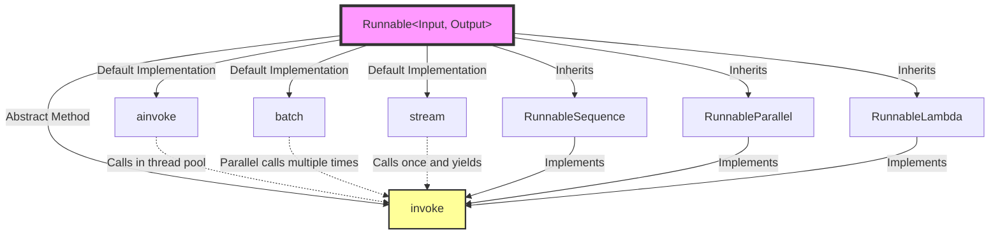

# 📚 Module 1: Everything is `Runnable` - LangChain's Core Abstraction

## 🎯 Learning Objectives

By the end of this module, you will be able to:
1. **Understand why** LangChain needs the `Runnable` abstraction
2. **Explain** the core "contract" of `Runnable` (required methods to implement)
3. **Analyze** the design philosophy behind sync/async, batching, and streaming
4. **Predict** how Runnable-based composition works

---

## 📁 File Context

**File Path:** `libs/core/langchain_core/runnables/base.py`
**File Size:** 6,100 lines of code
**Position in Architecture:** LangChain's **most core abstraction** - base class for all composable components

---

## 🧩 Part 1: Why Do We Need `Runnable`? (Design Philosophy)

### Problem: How to Make AI Applications Composable Like "LEGO Blocks"?

Before LangChain was created, building AI applications faced a core challenge:

```python
# ❌ Traditional approach: Each component has different interfaces, cannot compose
prompt_result = my_prompt.format(user_input="Hello")
llm_result = openai_client.chat.completions.create(messages=prompt_result)
parsed_result = json.loads(llm_result.choices[0].message.content)

# Problems:
# 1. Each step has different calling methods (format, create, loads)
# 2. Cannot automatically support batching or streaming
# 3. Cannot unify tracing and debugging
```

### Solution: The `Runnable` Protocol

LangChain defines a **unified interface contract** through `Runnable`:

```python
# ✅ LangChain approach: All components are Runnable, unified interface
chain = prompt | model | output_parser

# All Runnables support the same methods:
chain.invoke(input)           # Single invocation
chain.batch([input1, input2]) # Batching
chain.stream(input)           # Streaming output
chain.ainvoke(input)          # Async invocation
```

**Core Design Philosophy:**
> "If all components follow the same 'contract' (invoke/batch/stream), they can be freely composed like LEGO blocks, and the composed component automatically inherits these capabilities."

---

## 🔍 Part 2: Dependency Analysis (Context Connection)

Let's see what `base.py` imports, which reveals its responsibility boundaries:

### Key Import Categories:

```python
# 1. Async and concurrency support
import asyncio
from concurrent.futures import FIRST_COMPLETED, wait
# → Why? Because Runnable must support both sync and async

# 2. Abstract Base Class (ABC)
from abc import ABC, abstractmethod
# → Why? Runnable is a "contract", not a concrete implementation

# 3. Generic support
from typing import Generic, TypeVar
# → Why? Each Runnable has an Input type and Output type

# 4. Configuration and callback system
from langchain_core.runnables.config import RunnableConfig
from langchain_core.callbacks.manager import CallbackManager
# → Why? Needs unified config passing and execution tracing mechanism

# 5. Serialization support
from langchain_core.load.serializable import Serializable
# → Why? Runnable needs to be savable and loadable (for chain persistence)
```

**Key Insight:**
From the imports, we can see that `Runnable` is designed to be:
1. **Type-safe** (Generic[Input, Output])
2. **Async-friendly** (asyncio)
3. **Traceable** (callbacks)
4. **Composable** (serialization)

---

## 📐 Part 3: Core Class Definition (Deep Source Code Analysis)

### 3.1 Class Declaration

```python
# libs/core/langchain_core/runnables/base.py:123
class Runnable(ABC, Generic[Input, Output]):
    """A unit of work that can be invoked, batched, streamed, transformed and composed."""
```

**Word-by-word Analysis:**

1. **`ABC` (Abstract Base Class)**
   - This is an **abstract base class**, cannot be directly instantiated
   - Must be inherited by subclasses and implement abstract methods

2. **`Generic[Input, Output]`**
   - This is a **generic class** with two type parameters
   - `Input`: What type of input does this Runnable accept?
   - `Output`: What type of output does this Runnable produce?

   Example:
   ```python
   # A Runnable that accepts string, outputs dict
   class MyPrompt(Runnable[str, dict]):
       pass

   # A Runnable that accepts dict, outputs string
   class MyLLM(Runnable[dict, str]):
       pass
   ```

3. **"unit of work"**
   - This term reveals the design intent: `Runnable` is an **atomic computation unit**
   - It can be "invoked", "batched", "streamed", "composed"

### 3.2 Core Method 1: `invoke` (Abstract Method)

```python
# libs/core/langchain_core/runnables/base.py:817-838
@abstractmethod
def invoke(
    self,
    input: Input,
    config: RunnableConfig | None = None,
    **kwargs: Any,
) -> Output:
    """Transform a single input into an output.

    Args:
        input: The input to the `Runnable`.
        config: A config to use when invoking the `Runnable`.

    Returns:
        The output of the `Runnable`.
    """
```

**Why is this an abstract method?**

Because `invoke` is the **core contract** of `Runnable`. Every Runnable subclass (Prompt, LLM, OutputParser) must define "how to transform input into output".

**Design Philosophy of the `config` Parameter:**

```python
# Why not pass all parameters directly, but use a config dict?
# ❌ Bad design:
def invoke(self, input, tags=None, metadata=None, callbacks=None, max_concurrency=None, ...):
    pass  # Parameter explosion!

# ✅ Good design:
def invoke(self, input, config: RunnableConfig | None = None):
    # config = {
    #     "tags": ["my-chain"],
    #     "metadata": {"user_id": "123"},
    #     "callbacks": [ConsoleCallback()],
    #     "max_concurrency": 5,
    # }
    pass
```

**Key Insight:**
- `config` implements separation of **cross-cutting concerns**
- Debugging, tracing, concurrency control are all passed through `config`, not polluting business logic

### 3.3 Core Method 2: `ainvoke` (Async Version)

```python
# libs/core/langchain_core/runnables/base.py:840-861
async def ainvoke(
    self,
    input: Input,
    config: RunnableConfig | None = None,
    **kwargs: Any,
) -> Output:
    """Transform a single input into an output."""
    return await run_in_executor(config, self.invoke, input, config, **kwargs)
```

**Design Philosophy Interpretation:**

1. **Why is there a default implementation?**
   - Note: `ainvoke` is NOT `@abstractmethod`!
   - Default implementation: Run sync `invoke` in a thread pool
   - This means: **Subclasses only need to implement `invoke` to automatically get async support**

2. **Why design it this way?**
   ```python
   # Scenario: OpenAI's API is synchronous, but we want to use it in async apps
   # Without default implementation, every subclass would need to write this:
   async def ainvoke(self, input, config):
       loop = asyncio.get_event_loop()
       return await loop.run_in_executor(None, self.invoke, input, config)

   # LangChain's design: Provide default implementation in base class, avoid code duplication
   ```

3. **When should subclasses override `ainvoke`?**
   - When the underlying API natively supports async (e.g., `httpx`, `aiohttp`)
   - Example: `ChatOpenAI` overrides `ainvoke` to use `openai.AsyncClient`

### 3.4 Core Method 3: `batch` (Batching)

```python
# libs/core/langchain_core/runnables/base.py:863-911
def batch(
    self,
    inputs: list[Input],
    config: RunnableConfig | list[RunnableConfig] | None = None,
    *,
    return_exceptions: bool = False,
    **kwargs: Any | None,
) -> list[Output]:
    """Default implementation runs invoke in parallel using a thread pool executor."""
    if not inputs:
        return []

    configs = get_config_list(config, len(inputs))

    def invoke(input_: Input, config: RunnableConfig) -> Output | Exception:
        if return_exceptions:
            try:
                return self.invoke(input_, config, **kwargs)
            except Exception as e:
                return e
        else:
            return self.invoke(input_, config, **kwargs)

    # Optimization: Don't use thread pool for single input
    if len(inputs) == 1:
        return cast("list[Output]", [invoke(inputs[0], configs[0])])

    with get_executor_for_config(configs[0]) as executor:
        return cast("list[Output]", list(executor.map(invoke, inputs, configs)))
```

**Deep Design Philosophy Analysis:**

1. **Why does the default implementation use a thread pool?**
   ```python
   # For I/O-bound tasks (like API calls), thread pool can significantly improve performance
   # Example: Calling OpenAI API

   # ❌ Bad implementation: Serial calls
   def batch(self, inputs):
       return [self.invoke(input) for input in inputs]
   # 100 inputs × 1 second/call = 100 seconds

   # ✅ Good implementation: Parallel calls (LangChain's default)
   def batch(self, inputs):
       with ThreadPoolExecutor() as executor:
           return list(executor.map(self.invoke, inputs))
   # 100 inputs ÷ 10 threads × 1 second/call ≈ 10 seconds
   ```

2. **What is `return_exceptions=True` for?**
   ```python
   # Scenario: Batch processing 100 inputs, 5 fail

   # return_exceptions=False (default):
   # → Throws exception at first failure, remaining 95 are discarded

   # return_exceptions=True:
   # → Returns 95 success results + 5 exception objects
   results = runnable.batch(inputs, return_exceptions=True)
   successes = [r for r in results if not isinstance(r, Exception)]
   failures = [r for r in results if isinstance(r, Exception)]
   ```

3. **Why the single-input optimization?**
   ```python
   if len(inputs) == 1:
       return [invoke(inputs[0], configs[0])]
   ```
   - Avoid thread pool overhead (creation, scheduling, destruction)
   - For single input, direct call is faster

### 3.5 Core Method 4: `stream` (Streaming)

```python
# libs/core/langchain_core/runnables/base.py:1126-1145
def stream(
    self,
    input: Input,
    config: RunnableConfig | None = None,
    **kwargs: Any | None,
) -> Iterator[Output]:
    """Default implementation of `stream`, which calls `invoke`.

    Subclasses must override this method if they support streaming output.
    """
    yield self.invoke(input, config, **kwargs)
```

**Design Philosophy:**

1. **Why does the default implementation just `yield invoke`?**
   ```python
   # Default implementation: Wait for complete result, then return at once
   def stream(self, input, config):
       result = self.invoke(input, config)
       yield result  # Only yields once

   # This looks useless, but it ensures interface consistency:
   # Even if a component doesn't support true streaming, calling stream() won't error
   ```

2. **When should subclasses override `stream`?**
   ```python
   # Example: ChatOpenAI overrides stream
   class ChatOpenAI(Runnable):
       def stream(self, input, config):
           for chunk in openai.ChatCompletion.create(..., stream=True):
               yield chunk.choices[0].delta.content

   # Usage effect:
   for token in chat_model.stream("Tell me a joke"):
       print(token, end="", flush=True)
   # Output: W h y   d i d   t h e   c h i c k e n ...
   ```

---

## 🗺️ Part 4: Architecture Visualization (Dual Coding)

Let me show the core architecture of `Runnable` with a Mermaid diagram:



**Diagram Interpretation:**

1. **Purple box (Runnable)** = Abstract base class
2. **Yellow box (invoke)** = The only abstract method (must implement)
3. **Dashed arrows** = Default implementations depend on `invoke`
4. **Solid arrows (Inherits)** = Concrete subclasses

**Key Insight:**
> **Just implement `invoke`, and you automatically get default support for `ainvoke`, `batch`, `stream`!**

---

## 🔗 Part 5: The Magic of Composition (`|` Operator)

Let's see how composition is implemented:

```python
# libs/core/langchain_core/runnables/base.py:616-635
def __or__(
    self,
    other: Runnable[Any, Other] | Callable[[Any], Other] | ...,
) -> RunnableSerializable[Input, Other]:
    """Runnable "or" operator.

    Compose this `Runnable` with another object to create a `RunnableSequence`.
    """
    return RunnableSequence(self, coerce_to_runnable(other))
```

**Design Philosophy Interpretation:**

```python
# When you write:
chain = prompt | model | parser

# Python actually calls:
temp1 = prompt.__or__(model)           # Returns RunnableSequence([prompt, model])
chain = temp1.__or__(parser)           # Returns RunnableSequence([prompt, model, parser])

# RunnableSequence is also a Runnable, so it has invoke/batch/stream too!
# This is the secret of "composition automatically inherits all capabilities"
```

**The Role of `coerce_to_runnable`:**

```python
# Allows direct composition with plain functions!
def uppercase(text: str) -> str:
    return text.upper()

chain = prompt | model | uppercase  # uppercase is auto-wrapped as RunnableLambda
```

---

## 🧠 Knowledge Retrieval Challenge

Now, let me test your understanding of this module:

### Challenge 1: Conceptual Understanding (Generative Questions)

**Answer in your own words:**

1. **Why does LangChain need the `Runnable` abstraction? What problem does it solve?**
   (Hint: Think from "composability" and "interface unification" perspectives)

2. **What is the core "contract" of `Runnable`? What is the minimum a class must implement to be a valid Runnable?**

3. **Explain why `ainvoke`, `batch`, `stream` can have default implementations, but `invoke` must be an abstract method?**

### Challenge 2: Design Analysis (Analytical Questions)

4. **Suppose we want to create a new `Runnable` subclass `SQLExecutor`:**
   - What type of input does it accept? (What is the `Input` type?)
   - What type of output does it produce? (What is the `Output` type?)
   - How would you declare this class?

   ```python
   class SQLExecutor(Runnable[???, ???]):
       def invoke(self, input: ???, config=None):
           # Your implementation
           pass
   ```

5. **Predict: If the `invoke` method were not abstract (no `@abstractmethod`), what destructive impact would it have on LangChain's entire design?**

### Challenge 3: Source Code Reasoning (Deep Questions)

6. **Look at this code (batch's default implementation):**
   ```python
   with get_executor_for_config(configs[0]) as executor:
       return list(executor.map(invoke, inputs, configs))
   ```

   **Question:** Why use `executor.map` instead of manually creating threads? What guarantees does the `map` method provide?

7. **Composition Reasoning: Suppose we have three Runnables:**
   ```python
   A: Runnable[str, int]        # String → Integer
   B: Runnable[int, list[int]]  # Integer → Integer list
   C: Runnable[list[int], str]  # Integer list → String
   ```

   **Questions:**
   - What is the type of `A | B`?
   - What is the type of `A | B | C`?
   - What happens if you try `A | C` (skipping B)?

---

## 📝 Module Summary

You have now deeply understood:

✅ `Runnable`'s **design philosophy**: Unified interface → Composability
✅ Core **abstract method**: `invoke` is the only one that must be implemented
✅ **Wisdom** of default implementations: `ainvoke`, `batch`, `stream` built on `invoke`
✅ **Type safety**: `Generic[Input, Output]` ensures composition correctness
✅ **Composition magic**: `|` operator creates `RunnableSequence`

**Next Step:** Module 2 will dive into the source code of `RunnableSequence` and `RunnableParallel` to understand how composition actually works.
