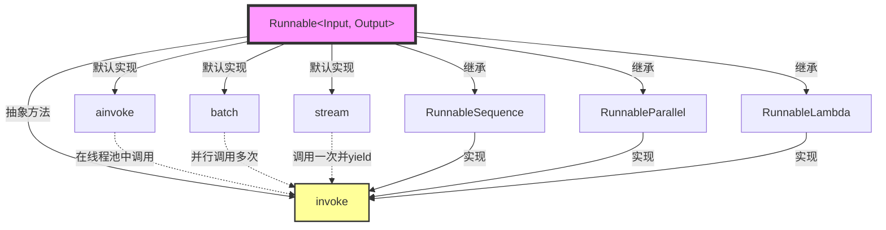

# 📚 模块 1：万物皆 `Runnable` - LangChain 的核心抽象

## 🎯 学习目标

在本模块结束时，您将能够：
1. **理解为什么** LangChain 需要 `Runnable` 这个抽象
2. **解释** `Runnable` 的核心"契约"（必须实现的方法）
3. **分析** 同步/异步、批处理、流式处理的设计哲学
4. **预测** 基于 `Runnable` 的组合如何工作

---

## 📁 文件上下文

**文件路径：** `libs/core/langchain_core/runnables/base.py`
**文件规模：** 6,100 行代码
**在架构中的位置：** LangChain 的**最核心抽象** - 所有可组合组件的基类

---

## 🧩 第一部分：为什么需要 `Runnable`？（设计哲学）

### 问题：如何让 AI 应用像"乐高积木"一样可组合？

在 LangChain 诞生之前，构建 AI 应用面临一个核心挑战：

```python
# ❌ 传统做法：每个组件接口不同，无法组合
prompt_result = my_prompt.format(user_input="Hello")
llm_result = openai_client.chat.completions.create(messages=prompt_result)
parsed_result = json.loads(llm_result.choices[0].message.content)

# 问题：
# 1. 每个步骤的调用方式不同（format、create、loads）
# 2. 无法自动支持批处理或流式输出
# 3. 无法统一追踪和调试
```

### 解决方案：`Runnable` 协议（Protocol）

LangChain 通过 `Runnable` 定义了一个**统一的接口契约**：

```python
# ✅ LangChain 做法：所有组件都是 Runnable，接口统一
chain = prompt | model | output_parser

# 所有 Runnable 都支持相同的方法：
chain.invoke(input)           # 单次调用
chain.batch([input1, input2]) # 批处理
chain.stream(input)           # 流式输出
chain.ainvoke(input)          # 异步调用
```

**核心设计哲学：**
> "如果所有组件都遵守同一个'契约'（invoke/batch/stream），那么它们就可以像乐高积木一样自由组合，而且组合后的新组件自动拥有这些能力。"

---

## 🔍 第二部分：依赖关系分析（上下文连接）

让我们看看 `base.py` 导入了什么，这揭示了它的职责边界：

### 关键导入分类：

```python
# 1. 异步与并发支持
import asyncio
from concurrent.futures import FIRST_COMPLETED, wait
# → 为什么？因为 Runnable 必须同时支持同步和异步

# 2. 抽象基类（ABC）
from abc import ABC, abstractmethod
# → 为什么？Runnable 是一个"契约"，不是具体实现

# 3. 泛型（Generic）支持
from typing import Generic, TypeVar
# → 为什么？每个 Runnable 都有输入类型 Input 和输出类型 Output

# 4. 配置与回调系统
from langchain_core.runnables.config import RunnableConfig
from langchain_core.callbacks.manager import CallbackManager
# → 为什么？需要统一的配置传递和执行追踪机制

# 5. 序列化支持
from langchain_core.load.serializable import Serializable
# → 为什么？Runnable 需要可保存、可加载（用于持久化链）
```

**关键洞察：**
从导入可以看出，`Runnable` 的设计目标是：
1. **类型安全**（Generic[Input, Output]）
2. **异步友好**（asyncio）
3. **可追踪**（callbacks）
4. **可组合**（序列化）

---

## 📐 第三部分：核心类定义（源码深度解读）

### 3.1 类声明

```python
# libs/core/langchain_core/runnables/base.py:123
class Runnable(ABC, Generic[Input, Output]):
    """A unit of work that can be invoked, batched, streamed, transformed and composed."""
```

**逐字解析：**

1. **`ABC`（Abstract Base Class）**
   - 这是一个**抽象基类**，不能直接实例化
   - 必须被子类继承并实现抽象方法

2. **`Generic[Input, Output]`**
   - 这是一个**泛型类**，有两个类型参数
   - `Input`：这个 Runnable 接受什么类型的输入？
   - `Output`：这个 Runnable 产生什么类型的输出？

   示例：
   ```python
   # 一个接受字符串、输出字典的 Runnable
   class MyPrompt(Runnable[str, dict]):
       pass

   # 一个接受字典、输出字符串的 Runnable
   class MyLLM(Runnable[dict, str]):
       pass
   ```

3. **"unit of work"（工作单元）**
   - 这个词揭示了设计意图：`Runnable` 是一个**原子化的计算单元**
   - 它可以被"invoked（调用）"、"batched（批处理）"、"streamed（流式处理）"、"composed（组合）"

### 3.2 核心方法一：`invoke`（抽象方法）

```python
# libs/core/langchain_core/runnables/base.py:817-838
@abstractmethod
def invoke(
    self,
    input: Input,
    config: RunnableConfig | None = None,
    **kwargs: Any,
) -> Output:
    """Transform a single input into an output.

    Args:
        input: The input to the `Runnable`.
        config: A config to use when invoking the `Runnable`.

    Returns:
        The output of the `Runnable`.
    """
```

**为什么这是抽象方法？**

因为 `invoke` 是 `Runnable` 的**核心契约**。每个 Runnable 子类（Prompt、LLM、OutputParser）都必须定义"如何将输入转换为输出"。

**`config` 参数的设计哲学：**

```python
# 为什么不直接传递所有参数，而是用一个 config 字典？
# ❌ 不好的设计：
def invoke(self, input, tags=None, metadata=None, callbacks=None, max_concurrency=None, ...):
    pass  # 参数爆炸！

# ✅ 好的设计：
def invoke(self, input, config: RunnableConfig | None = None):
    # config = {
    #     "tags": ["my-chain"],
    #     "metadata": {"user_id": "123"},
    #     "callbacks": [ConsoleCallback()],
    #     "max_concurrency": 5,
    # }
    pass
```

**关键洞察：**
- `config` 实现了**横切关注点**（cross-cutting concerns）的分离
- 调试、追踪、并发控制等都通过 `config` 传递，不污染业务逻辑

### 3.3 核心方法二：`ainvoke`（异步版本）

```python
# libs/core/langchain_core/runnables/base.py:840-861
async def ainvoke(
    self,
    input: Input,
    config: RunnableConfig | None = None,
    **kwargs: Any,
) -> Output:
    """Transform a single input into an output."""
    return await run_in_executor(config, self.invoke, input, config, **kwargs)
```

**设计哲学解读：**

1. **为什么有默认实现？**
   - 注意：`ainvoke` 不是 `@abstractmethod`！
   - 默认实现：在线程池中运行同步的 `invoke`
   - 这意味着：**子类只需要实现 `invoke`，就自动获得异步支持**

2. **为什么这样设计？**
   ```python
   # 场景：OpenAI 的 API 是同步的，但我们想在异步应用中使用
   # 如果没有默认实现，每个子类都要写这样的代码：
   async def ainvoke(self, input, config):
       loop = asyncio.get_event_loop()
       return await loop.run_in_executor(None, self.invoke, input, config)

   # LangChain 的设计：在基类提供默认实现，避免重复代码
   ```

3. **什么时候子类应该覆盖 `ainvoke`？**
   - 当底层 API 原生支持异步时（如 `httpx`、`aiohttp`）
   - 示例：`ChatOpenAI` 覆盖了 `ainvoke` 以使用 `openai.AsyncClient`

### 3.4 核心方法三：`batch`（批处理）

```python
# libs/core/langchain_core/runnables/base.py:863-911
def batch(
    self,
    inputs: list[Input],
    config: RunnableConfig | list[RunnableConfig] | None = None,
    *,
    return_exceptions: bool = False,
    **kwargs: Any | None,
) -> list[Output]:
    """Default implementation runs invoke in parallel using a thread pool executor."""
    if not inputs:
        return []

    configs = get_config_list(config, len(inputs))

    def invoke(input_: Input, config: RunnableConfig) -> Output | Exception:
        if return_exceptions:
            try:
                return self.invoke(input_, config, **kwargs)
            except Exception as e:
                return e
        else:
            return self.invoke(input_, config, **kwargs)

    # 优化：单个输入时不使用线程池
    if len(inputs) == 1:
        return cast("list[Output]", [invoke(inputs[0], configs[0])])

    with get_executor_for_config(configs[0]) as executor:
        return cast("list[Output]", list(executor.map(invoke, inputs, configs)))
```

**设计哲学深度解析：**

1. **为什么默认实现使用线程池？**
   ```python
   # 对于 I/O 密集型任务（如 API 调用），线程池可以显著提高性能
   # 示例：调用 OpenAI API

   # ❌ 不好的实现：串行调用
   def batch(self, inputs):
       return [self.invoke(input) for input in inputs]
   # 100个输入 × 1秒/调用 = 100秒

   # ✅ 好的实现：并行调用（LangChain 的默认）
   def batch(self, inputs):
       with ThreadPoolExecutor() as executor:
           return list(executor.map(self.invoke, inputs))
   # 100个输入 ÷ 10线程 × 1秒/调用 ≈ 10秒
   ```

2. **`return_exceptions=True` 的用途？**
   ```python
   # 场景：批处理100个输入，其中5个失败

   # return_exceptions=False（默认）：
   # → 遇到第一个异常就抛出，剩余95个被丢弃

   # return_exceptions=True：
   # → 返回 95 个成功结果 + 5 个异常对象
   results = runnable.batch(inputs, return_exceptions=True)
   successes = [r for r in results if not isinstance(r, Exception)]
   failures = [r for r in results if isinstance(r, Exception)]
   ```

3. **为什么有单输入优化？**
   ```python
   if len(inputs) == 1:
       return [invoke(inputs[0], configs[0])]
   ```
   - 避免线程池的开销（创建、调度、销毁）
   - 对于单个输入，直接调用更快

### 3.5 核心方法四：`stream`（流式输出）

```python
# libs/core/langchain_core/runnables/base.py:1126-1145
def stream(
    self,
    input: Input,
    config: RunnableConfig | None = None,
    **kwargs: Any | None,
) -> Iterator[Output]:
    """Default implementation of `stream`, which calls `invoke`.

    Subclasses must override this method if they support streaming output.
    """
    yield self.invoke(input, config, **kwargs)
```

**设计哲学：**

1. **为什么默认实现只是 `yield invoke`？**
   ```python
   # 默认实现：等待完整结果，然后一次性返回
   def stream(self, input, config):
       result = self.invoke(input, config)
       yield result  # 只 yield 一次

   # 这看起来没用，但它保证了接口一致性：
   # 即使组件不支持真正的流式，调用 stream() 也不会报错
   ```

2. **什么时候子类应该覆盖 `stream`？**
   ```python
   # 示例：ChatOpenAI 覆盖了 stream
   class ChatOpenAI(Runnable):
       def stream(self, input, config):
           for chunk in openai.ChatCompletion.create(..., stream=True):
               yield chunk.choices[0].delta.content

   # 使用效果：
   for token in chat_model.stream("Tell me a joke"):
       print(token, end="", flush=True)
   # 输出：W h y   d i d   t h e   c h i c k e n ...
   ```

---

## 🗺️ 第四部分：架构可视化（双重编码）

让我用 Mermaid 图表展示 `Runnable` 的核心架构：



**图表解读：**

1. **紫色框（Runnable）** = 抽象基类
2. **黄色框（invoke）** = 唯一的抽象方法（必须实现）
3. **虚线箭头** = 默认实现依赖于 `invoke`
4. **实线箭头（继承）** = 具体子类

**关键洞察：**
> **只要实现了 `invoke`，就自动获得 `ainvoke`、`batch`、`stream` 的默认支持！**

---

## 🔗 第五部分：组合的魔法（`|` 操作符）

让我们看看组合是如何实现的：

```python
# libs/core/langchain_core/runnables/base.py:616-635
def __or__(
    self,
    other: Runnable[Any, Other] | Callable[[Any], Other] | ...,
) -> RunnableSerializable[Input, Other]:
    """Runnable "or" operator.

    Compose this `Runnable` with another object to create a `RunnableSequence`.
    """
    return RunnableSequence(self, coerce_to_runnable(other))
```

**设计哲学解读：**

```python
# 当你写：
chain = prompt | model | parser

# Python 实际调用：
temp1 = prompt.__or__(model)           # 返回 RunnableSequence([prompt, model])
chain = temp1.__or__(parser)           # 返回 RunnableSequence([prompt, model, parser])

# RunnableSequence 也是 Runnable，所以它也有 invoke/batch/stream！
# 这就是"组合后自动拥有所有能力"的秘密
```

**`coerce_to_runnable` 的作用：**

```python
# 允许直接组合普通函数！
def uppercase(text: str) -> str:
    return text.upper()

chain = prompt | model | uppercase  # uppercase 被自动包装成 RunnableLambda
```

---

## 🧠 知识提取挑战

现在，让我测试您对本模块的理解：

### 挑战 1：概念理解（生成性问题）

**用您自己的话回答：**

1. **为什么 LangChain 需要 `Runnable` 这个抽象？它解决了什么问题？**
   （提示：从"组合性"和"接口统一"的角度思考）

2. **`Runnable` 的核心"契约"是什么？一个类要成为有效的 Runnable，最少必须实现什么？**

3. **解释为什么 `ainvoke`、`batch`、`stream` 可以有默认实现，但 `invoke` 必须是抽象方法？**

### 挑战 2：设计分析（分析性问题）

4. **假设我们要创建一个新的 `Runnable` 子类 `SQLExecutor`：**
   - 它接受什么类型的输入？（`Input` 类型是什么？）
   - 它产生什么类型的输出？（`Output` 类型是什么？）
   - 你会如何声明这个类？

   ```python
   class SQLExecutor(Runnable[???, ???]):
       def invoke(self, input: ???, config=None):
           # 你的实现
           pass
   ```

5. **预测：如果 `invoke` 方法不是抽象的（没有 `@abstractmethod`），会对整个 LangChain 的设计产生什么破坏性影响？**

### 挑战 3：源码推理（深度问题）

6. **查看这段代码（batch 的默认实现）：**
   ```python
   with get_executor_for_config(configs[0]) as executor:
       return list(executor.map(invoke, inputs, configs))
   ```

   **问题：** 为什么使用 `executor.map` 而不是手动创建线程？`map` 方法提供了什么保证？

7. **组合推理：假设我们有三个 Runnable：**
   ```python
   A: Runnable[str, int]        # 字符串 → 整数
   B: Runnable[int, list[int]]  # 整数 → 整数列表
   C: Runnable[list[int], str]  # 整数列表 → 字符串
   ```

   **问题：**
   - `A | B` 的类型是什么？
   - `A | B | C` 的类型是什么？
   - 如果尝试 `A | C`（跳过 B），会发生什么？

---

## 📝 本模块总结

您已经深入理解了：

✅ `Runnable` 的**设计哲学**：统一接口 → 可组合性
✅ 核心**抽象方法**：`invoke` 是唯一必须实现的
✅ 默认实现的**智慧**：`ainvoke`、`batch`、`stream` 基于 `invoke` 构建
✅ **类型安全**：`Generic[Input, Output]` 保证组合的正确性
✅ **组合魔法**：`|` 操作符创建 `RunnableSequence`

**下一步：** 模块 2 将深入研究 `RunnableSequence` 和 `RunnableParallel` 的源码，理解组合是如何实际工作的。
