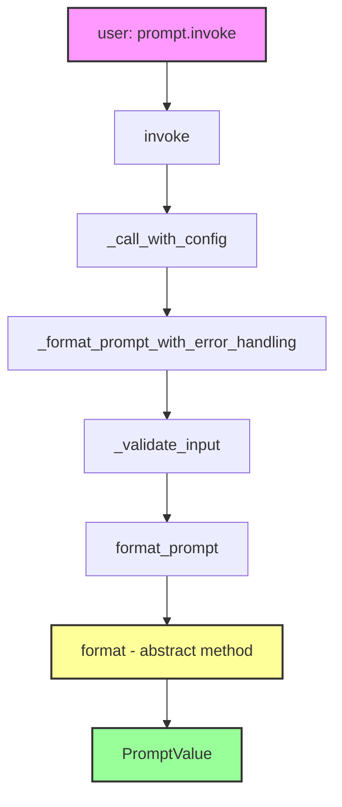
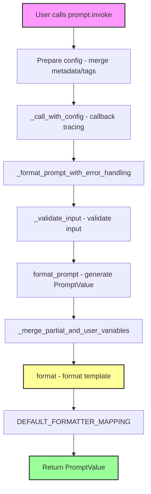
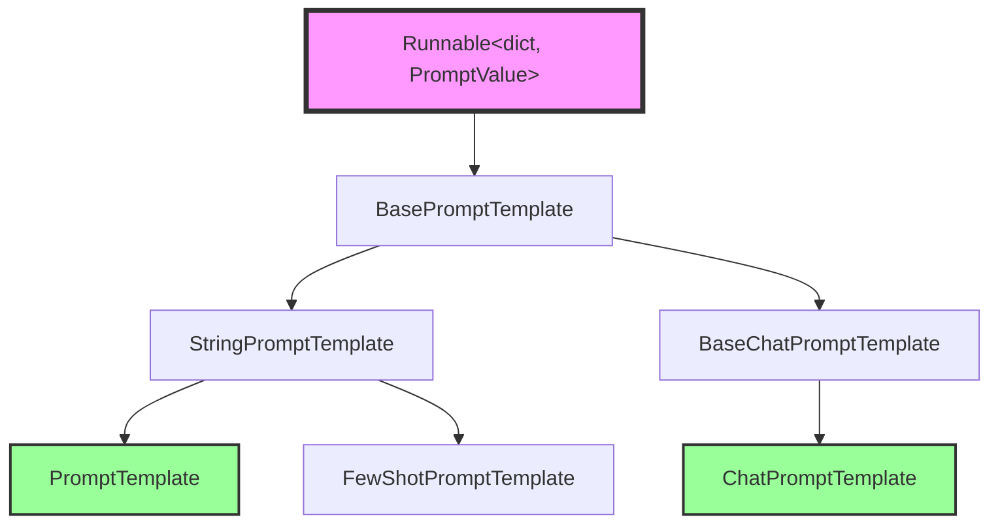

# 📚 Module 3: `Runnable` Implementation - Prompts

## 🎯 Learning Objectives

By the end of this module, you will be able to:
1. **Understand** how `BasePromptTemplate` implements the `Runnable` interface
2. **Explain** the call chain: `invoke` → `format_prompt` → `format`
3. **Analyze** the input validation mechanism (input_variables vs optional_variables)
4. **Master** the design philosophy of `partial_variables`

---

## 📁 File Context

**Main File Path:** `libs/core/langchain_core/prompts/base.py`
**Subclass Implementation:** `libs/core/langchain_core/prompts/prompt.py` (PromptTemplate)
**Position in Architecture:** The **first concrete implementation** of Runnable, base class for all prompt templates

---

## 🧩 Part 1: Why is Prompt a Runnable? (Design Motivation)

### Reviewing the Runnable Contract

In Module 1, we learned the core contract of Runnable:

```python
class Runnable(Generic[Input, Output]):
    @abstractmethod
    def invoke(self, input: Input, config: RunnableConfig | None = None) -> Output:
        pass
```

### Prompt as Runnable

```python
# libs/core/langchain_core/prompts/base.py:43-45
class BasePromptTemplate(
    RunnableSerializable[dict, PromptValue], ABC, Generic[FormatOutputType]
):
    """Base class for all prompt templates, returning a prompt."""
```

**Type Parameters Interpretation:**
- `Input` = `dict` - Accepts variable dictionary (e.g., `{"user": "Alice", "question": "..."}`)
- `Output` = `PromptValue` - Produces prompt value (convertible to string or message list)

**Why this design?**

```python
# Usage example:
from langchain_core.prompts import PromptTemplate

prompt = PromptTemplate.from_template("Hello {name}!")

# Prompt is Runnable, so it can be used like this:
result = prompt.invoke({"name": "Alice"})  # PromptValue
print(result.to_string())  # "Hello Alice!"

# Can compose with other Runnables:
chain = prompt | model | output_parser
```

**Key Insight:**
> Prompt implements the Runnable interface, enabling seamless composition with LLMs, output parsers, etc., into chains.

---

## 📐 Part 2: Core Field Design

Let's look at the key fields of `BasePromptTemplate`:

```python
# libs/core/langchain_core/prompts/base.py:48-74
class BasePromptTemplate(RunnableSerializable[dict, PromptValue]):
    input_variables: list[str]
    """List of required input variables"""

    optional_variables: list[str] = Field(default=[])
    """List of optional input variables"""

    input_types: Dict[str, Any] = Field(default_factory=dict)
    """Dictionary of variable types (default all str)"""

    partial_variables: Mapping[str, Any] = Field(default_factory=dict)
    """Partial variables dictionary - pre-filled values"""

    output_parser: BaseOutputParser | None = None
    """Optional output parser"""
```

### Deep Design Philosophy Analysis

**1. `input_variables` vs `optional_variables`**

```python
# Scenario: Chat prompt template
from langchain_core.prompts import ChatPromptTemplate, MessagesPlaceholder

prompt = ChatPromptTemplate.from_messages([
    ("system", "You are a helpful assistant."),
    MessagesPlaceholder("history", optional=True),  # Optional!
    ("human", "{question}"),  # Required!
])

# User can omit history:
prompt.invoke({"question": "Hi"})  # ✅ Valid

# But must provide question:
prompt.invoke({"history": [...]})  # ❌ Error: missing question
```

**Why this distinction?**
- **Required variables**: User must provide, otherwise prompt cannot be generated
- **Optional variables**: Framework auto-infers (e.g., MessagesPlaceholder), user can omit

**2. `partial_variables` - Partial Application Pattern**

```python
# Scenario: Reuse prompt with preset values
base_prompt = PromptTemplate.from_template(
    "Translate {text} to {language}"
)

# Create partial application version:
french_prompt = base_prompt.partial(language="French")

# Now only need to provide text:
french_prompt.invoke({"text": "Hello"})
# → "Translate Hello to French"

# partial_variables supports functions (lazy evaluation):
from datetime import datetime

prompt = PromptTemplate.from_template(
    "Today is {today}. {question}"
).partial(today=lambda: datetime.now().strftime("%Y-%m-%d"))

prompt.invoke({"question": "What's the weather?"})
# → "Today is 2025-11-16. What's the weather?"
```

**Key Insight:**
> `partial_variables` implements "partial application" from functional programming, making prompt templates more reusable.

---

## ⚙️ Part 3: The `invoke` Call Chain

This is Prompt's most core implementation:

```python
# libs/core/langchain_core/prompts/base.py:199-223
@override
def invoke(
    self, input: dict, config: RunnableConfig | None = None, **kwargs: Any
) -> PromptValue:
    """Invoke the prompt."""
    config = ensure_config(config)
    if self.metadata:
        config["metadata"] = {**config["metadata"], **self.metadata}
    if self.tags:
        config["tags"] += self.tags
    return self._call_with_config(
        self._format_prompt_with_error_handling,
        input,
        config,
        run_type="prompt",
        serialized=self._serialized,
    )
```

### Call Chain Visualization



### Layer-by-Layer Analysis

**Layer 1: `invoke` - Config Preparation**

```python
config = ensure_config(config)
# Merge metadata and tags:
if self.metadata:
    config["metadata"] = {**config["metadata"], **self.metadata}
if self.tags:
    config["tags"] += self.tags
```

**Why do this?**
- Prompt can carry its own metadata and tags (for tracing)
- These automatically merge into execution config

**Layer 2: `_format_prompt_with_error_handling` - Input Validation**

```python
# libs/core/langchain_core/prompts/base.py:189-191
def _format_prompt_with_error_handling(self, inner_input: dict) -> PromptValue:
    inner_input_ = self._validate_input(inner_input)
    return self.format_prompt(**inner_input_)
```

**Layer 3: `_validate_input` - Smart Validation**

```python
# libs/core/langchain_core/prompts/base.py:155-187
def _validate_input(self, inner_input: Any) -> dict:
    # Auto-wrap single input:
    if not isinstance(inner_input, dict):
        if len(self.input_variables) == 1:
            var_name = self.input_variables[0]
            inner_input = {var_name: inner_input}
        else:
            raise TypeError("Expected dict as input")

    # Check missing variables:
    missing = set(self.input_variables).difference(inner_input)
    if missing:
        example_key = missing.pop()
        msg = (
            f"Input to {self.__class__.__name__} is missing variables {missing}. "
            f"Expected: {self.input_variables}. "
            f"Received: {list(inner_input.keys())}"
            f"\nNote: if you intended {{{example_key}}} to be part of the string "
            f"and not a variable, please escape it with double curly braces like: "
            f"'{{{{{example_key}}}}}'."
        )
        raise KeyError(msg)

    return inner_input
```

**Design Wisdom:**

1. **Auto Single-Value Wrapping**
   ```python
   prompt = PromptTemplate.from_template("Hello {name}")

   # Both invocation methods work:
   prompt.invoke({"name": "Alice"})  # Explicit dict
   prompt.invoke("Alice")  # Auto-wrapped to {"name": "Alice"}
   ```

2. **Friendly Error Messages**
   ```python
   prompt = PromptTemplate.from_template("Hello {user}, question: {question}")
   prompt.invoke({"user": "Alice"})  # Missing question

   # Error message:
   # Input to PromptTemplate is missing variables {'question'}.
   # Expected: ['user', 'question']
   # Received: ['user']
   # Note: if you intended {question} to be part of the string and not a variable,
   # please escape it with double curly braces like: '{{question}}'.
   ```

**Layer 4: `format_prompt` and `format` - Abstract Methods**

```python
# libs/core/langchain_core/prompts/base.py:251-260
@abstractmethod
def format_prompt(self, **kwargs: Any) -> PromptValue:
    """Create `PromptValue`."""

# libs/core/langchain_core/prompts/base.py:296-310
@abstractmethod
def format(self, **kwargs: Any) -> FormatOutputType:
    """Format the prompt with the inputs."""
```

**Why two methods?**
- `format()` → Returns formatted string (or message list)
- `format_prompt()` → Returns `PromptValue` (wrapped result)

---

## 🔍 Part 4: `PromptTemplate` Concrete Implementation

Let's see how `PromptTemplate` implements these abstract methods:

```python
# libs/core/langchain_core/prompts/prompt.py:23-56
class PromptTemplate(StringPromptTemplate):
    """Prompt template for a language model."""

    template: str
    """The prompt template."""

    template_format: PromptTemplateFormat = "f-string"
    """The format of the prompt template. Options are: 'f-string', 'mustache', 'jinja2'."""
```

### `format` Implementation

```python
# libs/core/langchain_core/prompts/prompt.py:187-197
def format(self, **kwargs: Any) -> str:
    """Format the prompt with the inputs."""
    kwargs = self._merge_partial_and_user_variables(**kwargs)
    return DEFAULT_FORMATTER_MAPPING[self.template_format](self.template, **kwargs)
```

**Key Steps:**

1. **Merge partial and user variables**
   ```python
   # libs/core/langchain_core/prompts/base.py:289-294
   def _merge_partial_and_user_variables(self, **kwargs: Any) -> dict[str, Any]:
       # Get partial params (call if function):
       partial_kwargs = {
           k: v if not callable(v) else v()
           for k, v in self.partial_variables.items()
       }
       return {**partial_kwargs, **kwargs}
   ```

2. **Call appropriate formatter based on template format**
   ```python
   DEFAULT_FORMATTER_MAPPING = {
       "f-string": lambda template, **kwargs: template.format(**kwargs),
       "jinja2": _render_jinja2,
       "mustache": _render_mustache,
   }
   ```

### `from_template` Smart Inference

```python
# libs/core/langchain_core/prompts/prompt.py:250-299
@classmethod
def from_template(
    cls,
    template: str,
    *,
    template_format: PromptTemplateFormat = "f-string",
    partial_variables: dict[str, Any] | None = None,
    **kwargs: Any,
) -> PromptTemplate:
    """Load a prompt template from a template."""
    # Auto-infer input variables!
    input_variables = get_template_variables(template, template_format)
    partial_variables_ = partial_variables or {}

    if partial_variables_:
        input_variables = [
            var for var in input_variables if var not in partial_variables_
        ]

    return cls(
        input_variables=input_variables,
        template=template,
        template_format=template_format,
        partial_variables=partial_variables_,
        **kwargs,
    )
```

**Example:**

```python
# Auto-infer input_variables:
prompt = PromptTemplate.from_template(
    "Hello {user}! Your question is: {question}"
)
# prompt.input_variables == ["user", "question"]

# If partial_variables, removed from input_variables:
prompt = PromptTemplate.from_template(
    "Hello {user}! Today is {date}. Your question is: {question}",
    partial_variables={"date": lambda: datetime.now().strftime("%Y-%m-%d")}
)
# prompt.input_variables == ["user", "question"]  # date not included
# prompt.partial_variables == {"date": <function>}
```

---

## 🔗 Part 5: Prompt's Composition Capabilities

### `+` Operator (Template Concatenation)

```python
system_prompt = PromptTemplate.from_template("You are a {role}.")
user_prompt = PromptTemplate.from_template("User question: {question}")

combined = system_prompt + "\n" + user_prompt
# combined.template == "You are a {role}.\nUser question: {question}"
# combined.input_variables == ["role", "question"]

# Actual usage:
combined.invoke({"role": "helpful assistant", "question": "Hi!"})
# → "You are a helpful assistant.\nUser question: Hi!"
```

### `|` Operator (Composition with Other Runnables)

```python
from langchain_core.prompts import PromptTemplate
from langchain_openai import ChatOpenAI
from langchain_core.output_parsers import StrOutputParser

# Prompt is Runnable, so can compose like this:
chain = (
    PromptTemplate.from_template("Translate {text} to {language}")
    | ChatOpenAI()
    | StrOutputParser()
)

result = chain.invoke({"text": "Hello", "language": "French"})
# → "Bonjour"
```

---

## 📊 Part 6: Architecture Visualization

**Complete Invoke Call Chain:**



**Class Inheritance Relationship:**



---

## 🧠 Knowledge Retrieval Challenge

### Challenge 1: Conceptual Understanding

1. **Why is `BasePromptTemplate` typed as `Runnable[dict, PromptValue]` instead of `Runnable[dict, str]`? What is the purpose of `PromptValue`?**

2. **Explain the difference between `input_variables` and `optional_variables`. When should you use `optional_variables`?**

3. **`partial_variables` supports functions, not just values. Why this design? Give a practical use case.**

### Challenge 2: Source Code Reasoning

4. **Look at the `_validate_input` code. What happens if the user passes a single string instead of a dict? What are the limitations of this auto-wrapping feature?**

5. **Suppose we have:**
   ```python
   prompt = PromptTemplate.from_template(
       "Hello {user}! Today is {date}. Question: {question}",
       partial_variables={"date": lambda: "2025-11-16"}
   )
   ```

   **Questions:**
   - What is `prompt.input_variables`?
   - What is `prompt.partial_variables`?
   - When calling `prompt.invoke({"user": "Alice", "question": "Hi"})`, what does `_merge_partial_and_user_variables` return?

### Challenge 3: Design Analysis

6. **`PromptTemplate`'s `__add__` method allows `+` concatenation. Why check if `template_format` is the same? What problems would occur without this check?**

7. **Predict: If two `PromptTemplate`s have the same `partial_variable` key but different values, what happens with the `+` operation? Is this design reasonable?**

---

## 📝 Module 3 Summary

You have now deeply understood:

✅ **Prompt as Runnable**: `BasePromptTemplate` implements `Runnable[dict, PromptValue]`
✅ **Input Validation Mechanism**: `_validate_input`'s smart wrapping and friendly error messages
✅ **Call Chain**: `invoke` → `_format_prompt_with_error_handling` → `format_prompt` → `format`
✅ **Partial Application**: `partial_variables` supports functions, enabling lazy evaluation
✅ **Template Formats**: Abstraction of f-string/jinja2/mustache
✅ **Composition Capabilities**: `+` concatenates templates, `|` composes with other Runnables

**Next Step:** Module 4 will analyze how LLMs implement the Runnable interface
