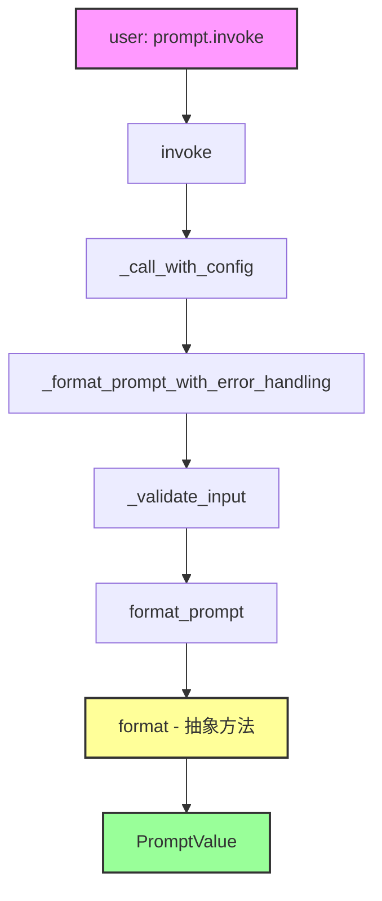
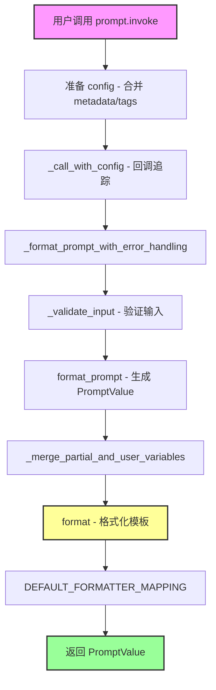
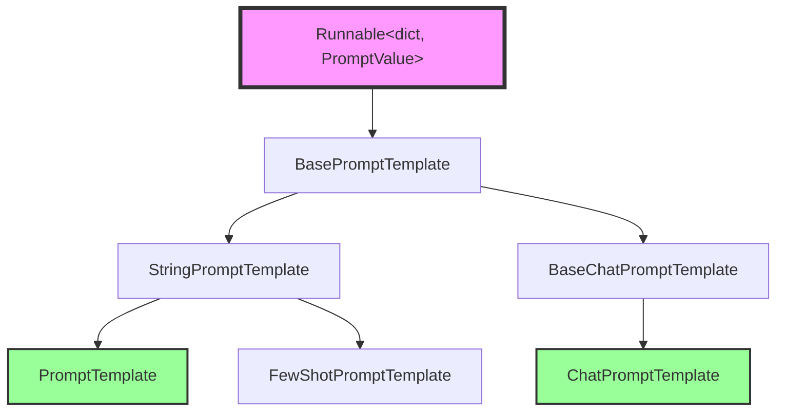

# 📚 模块 3：`Runnable` 的实现 - Prompts

## 🎯 学习目标

在本模块结束时，您将能够：
1. **理解** `BasePromptTemplate` 如何实现 `Runnable` 接口
2. **解释** `invoke` → `format_prompt` → `format` 的调用链
3. **分析** 输入验证机制（input_variables vs optional_variables）
4. **掌握** `partial_variables` 的设计哲学

---

## 📁 文件上下文

**主文件路径：** `libs/core/langchain_core/prompts/base.py`
**子类实现：** `libs/core/langchain_core/prompts/prompt.py` (PromptTemplate)
**在架构中的位置：** Runnable 的**第一个具体实现**，所有提示模板的基类

---

## 🧩 第一部分：为什么 Prompt 是 Runnable？（设计动机）

### 回顾 Runnable 的契约

在模块 1 中，我们学到了 Runnable 的核心契约：

```python
class Runnable(Generic[Input, Output]):
    @abstractmethod
    def invoke(self, input: Input, config: RunnableConfig | None = None) -> Output:
        pass
```

### Prompt 作为 Runnable

```python
# libs/core/langchain_core/prompts/base.py:43-45
class BasePromptTemplate(
    RunnableSerializable[dict, PromptValue], ABC, Generic[FormatOutputType]
):
    """Base class for all prompt templates, returning a prompt."""
```

**类型参数解读：**
- `Input` = `dict` - 接受变量字典（如 `{"user": "Alice", "question": "..."}`）
- `Output` = `PromptValue` - 产生提示值（可转换为字符串或消息列表）

**为什么这样设计？**

```python
# 使用示例：
from langchain_core.prompts import PromptTemplate

prompt = PromptTemplate.from_template("Hello {name}!")

# Prompt 是 Runnable，所以可以这样用：
result = prompt.invoke({"name": "Alice"})  # PromptValue
print(result.to_string())  # "Hello Alice!"

# 可以与其他 Runnable 组合：
chain = prompt | model | output_parser
```

**关键洞察：**
> Prompt 实现 Runnable 接口，使其可以无缝地与 LLM、输出解析器等组合成链。

---

## 📐 第二部分：核心字段设计

让我们看看 `BasePromptTemplate` 的关键字段：

```python
# libs/core/langchain_core/prompts/base.py:48-74
class BasePromptTemplate(RunnableSerializable[dict, PromptValue]):
    input_variables: list[str]
    """必需的输入变量列表"""

    optional_variables: list[str] = Field(default=[])
    """可选的输入变量列表"""

    input_types: Dict[str, Any] = Field(default_factory=dict)
    """变量类型字典（默认都是 str）"""

    partial_variables: Mapping[str, Any] = Field(default_factory=dict)
    """部分变量字典 - 预填充的值"""

    output_parser: BaseOutputParser | None = None
    """可选的输出解析器"""
```

### 设计哲学深度解析

**1. `input_variables` vs `optional_variables`**

```python
# 场景：聊天提示模板
from langchain_core.prompts import ChatPromptTemplate, MessagesPlaceholder

prompt = ChatPromptTemplate.from_messages([
    ("system", "You are a helpful assistant."),
    MessagesPlaceholder("history", optional=True),  # 可选！
    ("human", "{question}"),  # 必需！
])

# 用户可以不提供 history：
prompt.invoke({"question": "Hi"})  # ✅ 有效

# 但必须提供 question：
prompt.invoke({"history": [...]})  # ❌ 报错：缺少 question
```

**为什么需要这个区分？**
- **必需变量**：用户必须提供，否则无法生成提示
- **可选变量**：框架自动推断（如 MessagesPlaceholder），用户可以不提供

**2. `partial_variables` - 部分应用模式**

```python
# 场景：重用带有预设值的提示
base_prompt = PromptTemplate.from_template(
    "Translate {text} to {language}"
)

# 创建部分应用版本：
french_prompt = base_prompt.partial(language="French")

# 现在只需提供 text：
french_prompt.invoke({"text": "Hello"})
# → "Translate Hello to French"

# partial_variables 支持函数（延迟计算）：
from datetime import datetime

prompt = PromptTemplate.from_template(
    "Today is {today}. {question}"
).partial(today=lambda: datetime.now().strftime("%Y-%m-%d"))

prompt.invoke({"question": "What's the weather?"})
# → "Today is 2025-11-16. What's the weather?"
```

**关键洞察：**
> `partial_variables` 实现了函数式编程中的"部分应用"（partial application），使提示模板更可复用。

---

## ⚙️ 第三部分：`invoke` 的调用链

这是 Prompt 最核心的实现：

```python
# libs/core/langchain_core/prompts/base.py:199-223
@override
def invoke(
    self, input: dict, config: RunnableConfig | None = None, **kwargs: Any
) -> PromptValue:
    """Invoke the prompt."""
    config = ensure_config(config)
    if self.metadata:
        config["metadata"] = {**config["metadata"], **self.metadata}
    if self.tags:
        config["tags"] += self.tags
    return self._call_with_config(
        self._format_prompt_with_error_handling,
        input,
        config,
        run_type="prompt",
        serialized=self._serialized,
    )
```

### 调用链可视化



### 逐层解析

**层级 1：`invoke` - 配置准备**

```python
config = ensure_config(config)
# 合并 metadata 和 tags：
if self.metadata:
    config["metadata"] = {**config["metadata"], **self.metadata}
if self.tags:
    config["tags"] += self.tags
```

**为什么这样做？**
- Prompt 可以携带自己的 metadata 和 tags（用于追踪）
- 这些会自动合并到执行配置中

**层级 2：`_format_prompt_with_error_handling` - 输入验证**

```python
# libs/core/langchain_core/prompts/base.py:189-191
def _format_prompt_with_error_handling(self, inner_input: dict) -> PromptValue:
    inner_input_ = self._validate_input(inner_input)
    return self.format_prompt(**inner_input_)
```

**层级 3：`_validate_input` - 智能验证**

```python
# libs/core/langchain_core/prompts/base.py:155-187
def _validate_input(self, inner_input: Any) -> dict:
    # 自动包装单个输入：
    if not isinstance(inner_input, dict):
        if len(self.input_variables) == 1:
            var_name = self.input_variables[0]
            inner_input = {var_name: inner_input}
        else:
            raise TypeError("Expected dict as input")

    # 检查缺失变量：
    missing = set(self.input_variables).difference(inner_input)
    if missing:
        example_key = missing.pop()
        msg = (
            f"Input to {self.__class__.__name__} is missing variables {missing}. "
            f"Expected: {self.input_variables}. "
            f"Received: {list(inner_input.keys())}"
            f"\nNote: if you intended {{{example_key}}} to be part of the string "
            f"and not a variable, please escape it with double curly braces like: "
            f"'{{{{{example_key}}}}}'."
        )
        raise KeyError(msg)

    return inner_input
```

**设计智慧：**

1. **自动单值包装**
   ```python
   prompt = PromptTemplate.from_template("Hello {name}")

   # 两种调用方式都有效：
   prompt.invoke({"name": "Alice"})  # 显式字典
   prompt.invoke("Alice")  # 自动包装成 {"name": "Alice"}
   ```

2. **友好的错误消息**
   ```python
   prompt = PromptTemplate.from_template("Hello {user}, question: {question}")
   prompt.invoke({"user": "Alice"})  # 缺少 question

   # 错误消息：
   # Input to PromptTemplate is missing variables {'question'}.
   # Expected: ['user', 'question']
   # Received: ['user']
   # Note: if you intended {question} to be part of the string and not a variable,
   # please escape it with double curly braces like: '{{question}}'.
   ```

**层级 4：`format_prompt` 和 `format` - 抽象方法**

```python
# libs/core/langchain_core/prompts/base.py:251-260
@abstractmethod
def format_prompt(self, **kwargs: Any) -> PromptValue:
    """Create `PromptValue`."""

# libs/core/langchain_core/prompts/base.py:296-310
@abstractmethod
def format(self, **kwargs: Any) -> FormatOutputType:
    """Format the prompt with the inputs."""
```

**为什么有两个方法？**
- `format()` → 返回格式化后的字符串（或消息列表）
- `format_prompt()` → 返回 `PromptValue`（包装后的结果）

---

## 🔍 第四部分：`PromptTemplate` 的具体实现

让我们看看 `PromptTemplate` 如何实现这些抽象方法：

```python
# libs/core/langchain_core/prompts/prompt.py:23-56
class PromptTemplate(StringPromptTemplate):
    """Prompt template for a language model."""

    template: str
    """The prompt template."""

    template_format: PromptTemplateFormat = "f-string"
    """The format of the prompt template. Options are: 'f-string', 'mustache', 'jinja2'."""
```

### `format` 的实现

```python
# libs/core/langchain_core/prompts/prompt.py:187-197
def format(self, **kwargs: Any) -> str:
    """Format the prompt with the inputs."""
    kwargs = self._merge_partial_and_user_variables(**kwargs)
    return DEFAULT_FORMATTER_MAPPING[self.template_format](self.template, **kwargs)
```

**关键步骤：**

1. **合并 partial 和用户变量**
   ```python
   # libs/core/langchain_core/prompts/base.py:289-294
   def _merge_partial_and_user_variables(self, **kwargs: Any) -> dict[str, Any]:
       # 获取 partial 参数（如果是函数，则调用）：
       partial_kwargs = {
           k: v if not callable(v) else v()
           for k, v in self.partial_variables.items()
       }
       return {**partial_kwargs, **kwargs}
   ```

2. **根据模板格式调用相应的格式化器**
   ```python
   DEFAULT_FORMATTER_MAPPING = {
       "f-string": lambda template, **kwargs: template.format(**kwargs),
       "jinja2": _render_jinja2,
       "mustache": _render_mustache,
   }
   ```

### `from_template` 的智能推断

```python
# libs/core/langchain_core/prompts/prompt.py:250-299
@classmethod
def from_template(
    cls,
    template: str,
    *,
    template_format: PromptTemplateFormat = "f-string",
    partial_variables: dict[str, Any] | None = None,
    **kwargs: Any,
) -> PromptTemplate:
    """Load a prompt template from a template."""
    # 自动推断输入变量！
    input_variables = get_template_variables(template, template_format)
    partial_variables_ = partial_variables or {}

    if partial_variables_:
        input_variables = [
            var for var in input_variables if var not in partial_variables_
        ]

    return cls(
        input_variables=input_variables,
        template=template,
        template_format=template_format,
        partial_variables=partial_variables_,
        **kwargs,
    )
```

**示例：**

```python
# 自动推断 input_variables：
prompt = PromptTemplate.from_template(
    "Hello {user}! Your question is: {question}"
)
# prompt.input_variables == ["user", "question"]

# 如果有 partial_variables，会从 input_variables 中移除：
prompt = PromptTemplate.from_template(
    "Hello {user}! Today is {date}. Your question is: {question}",
    partial_variables={"date": lambda: datetime.now().strftime("%Y-%m-%d")}
)
# prompt.input_variables == ["user", "question"]  # date 不在其中
# prompt.partial_variables == {"date": <function>}
```

---

## 🔗 第五部分：Prompt 的组合能力

### `+` 操作符（模板拼接）

```python
# libs/core/langchain_core/prompts/prompt.py:138-180
def __add__(self, other: Any) -> PromptTemplate:
    """Override the + operator to allow for combining prompt templates."""
    if isinstance(other, PromptTemplate):
        if self.template_format != other.template_format:
            raise ValueError("Cannot add templates of different formats")

        input_variables = list(
            set(self.input_variables) | set(other.input_variables)
        )
        template = self.template + other.template
        partial_variables = dict(self.partial_variables.items())

        for k, v in other.partial_variables.items():
            if k in partial_variables:
                raise ValueError("Cannot have same variable partialed twice.")
            partial_variables[k] = v

        return PromptTemplate(
            template=template,
            input_variables=input_variables,
            partial_variables=partial_variables,
            template_format=self.template_format,
        )

    if isinstance(other, str):
        prompt = PromptTemplate.from_template(other, template_format=self.template_format)
        return self + prompt

    raise NotImplementedError(f"Unsupported operand type for +: {type(other)}")
```

**使用示例：**

```python
system_prompt = PromptTemplate.from_template("You are a {role}.")
user_prompt = PromptTemplate.from_template("User question: {question}")

combined = system_prompt + "\n" + user_prompt
# combined.template == "You are a {role}.\nUser question: {question}"
# combined.input_variables == ["role", "question"]

# 实际使用：
combined.invoke({"role": "helpful assistant", "question": "Hi!"})
# → "You are a helpful assistant.\nUser question: Hi!"
```

### `|` 操作符（与其他 Runnable 组合）

```python
from langchain_core.prompts import PromptTemplate
from langchain_openai import ChatOpenAI
from langchain_core.output_parsers import StrOutputParser

# Prompt 是 Runnable，所以可以这样组合：
chain = (
    PromptTemplate.from_template("Translate {text} to {language}")
    | ChatOpenAI()
    | StrOutputParser()
)

result = chain.invoke({"text": "Hello", "language": "French"})
# → "Bonjour"
```

---

## 📊 第六部分：架构可视化

**完整的 Invoke 调用链：**



**类继承关系：**



---

## 🧠 知识提取挑战

### 挑战 1：概念理解

1. **为什么 `BasePromptTemplate` 的类型是 `Runnable[dict, PromptValue]` 而不是 `Runnable[dict, str]`？`PromptValue` 的作用是什么？**

2. **解释 `input_variables` 和 `optional_variables` 的区别。什么时候应该使用 `optional_variables`？**

3. **`partial_variables` 支持函数而不仅仅是值。为什么这样设计？举一个实际应用场景。**

### 挑战 2：源码推理

4. **查看 `_validate_input` 的代码。如果用户传递的是单个字符串而不是字典，会发生什么？这个自动包装功能有什么限制？**

5. **假设我们有：**
   ```python
   prompt = PromptTemplate.from_template(
       "Hello {user}! Today is {date}. Question: {question}",
       partial_variables={"date": lambda: "2025-11-16"}
   )
   ```

   **问题：**
   - `prompt.input_variables` 是什么？
   - `prompt.partial_variables` 是什么？
   - 调用 `prompt.invoke({"user": "Alice", "question": "Hi"})` 时，`_merge_partial_and_user_variables` 返回什么？

### 挑战 3：设计分析

6. **`PromptTemplate` 的 `__add__` 方法允许使用 `+` 拼接模板。为什么要检查 `template_format` 是否相同？如果不检查会有什么问题？**

7. **预测：如果两个 `PromptTemplate` 有相同的 `partial_variable` 键但值不同，`+` 操作会怎样？这样设计合理吗？**

---

## 📝 模块 3 总结

您已经深入理解了：

✅ **Prompt 作为 Runnable**：`BasePromptTemplate` 实现了 `Runnable[dict, PromptValue]`
✅ **输入验证机制**：`_validate_input` 的智能包装和友好错误消息
✅ **调用链**：`invoke` → `_format_prompt_with_error_handling` → `format_prompt` → `format`
✅ **部分应用**：`partial_variables` 支持函数，实现延迟计算
✅ **模板格式**：f-string/jinja2/mustache 的抽象化
✅ **组合能力**：`+` 拼接模板，`|` 与其他 Runnable 组合

**下一步：** 模块 4 将分析 LLM 如何实现 Runnable 接口
