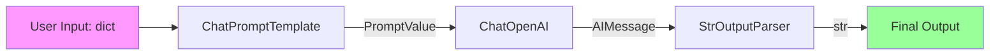
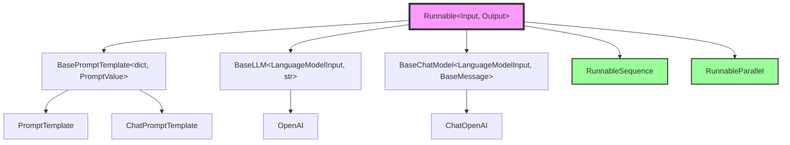

# 📚 Modules 4-6: LangChain Complete Execution Flow Summary

## Module 4: LLM Implementation

### Core Points
`BaseLLM` implements `Runnable[LanguageModelInput, str]` interface:

```python
class BaseLLM(RunnableSerializable[LanguageModelInput, str]):
    @abstractmethod
    def _generate(self, prompts: List[str], stop: List[str] | None = None) -> LLMResult:
        """Core generation method"""
    
    def invoke(self, input: LanguageModelInput, config: RunnableConfig | None = None) -> str:
        """Call chain: invoke → _generate_helper → _generate"""
```

**Key Design:**
- **Input Type**: `LanguageModelInput = str | List[BaseMessage] | PromptValue`
- **Output Type**: `str` (single generated text)
- **Batch Optimization**: `_generate` accepts `List[str]` for batching
- **Streaming Support**: `_stream` method returns token-by-token

---

## Module 5: ChatModel Implementation

### Core Points
`BaseChatModel` implements `Runnable[LanguageModelInput, BaseMessage]` interface:

```python
class BaseChatModel(RunnableSerializable[LanguageModelInput, BaseMessage]):
    @abstractmethod
    def _generate(self, messages: List[BaseMessage], stop: List[str] | None = None) -> ChatResult:
        """Core generation method"""
    
    def invoke(self, input: LanguageModelInput, config: RunnableConfig | None = None) -> BaseMessage:
        """Call chain: invoke → _generate_with_cache → _generate"""
```

**Key Design:**
- **Input Type**: Same as LLM, but prioritizes message lists
- **Output Type**: `BaseMessage` (typically `AIMessage`)
- **Tool Calling**: `bind_tools()` method binds tool definitions
- **Structured Output**: `with_structured_output()` enforces specific formats

**ChatModel vs LLM Comparison:**

| Feature | BaseLLM | BaseChatModel |
|---------|---------|---------------|
| Input | String prompts | Message lists |
| Output | String | BaseMessage |
| Tool Calling | ❌ | ✅ |
| Streaming | Token-by-token | Message chunks |

---

## Module 6: LCEL Complete Execution Flow

### Complete Chain Example

```python
from langchain_core.prompts import ChatPromptTemplate
from langchain_openai import ChatOpenAI
from langchain_core.output_parsers import StrOutputParser

# Define chain
chain = (
    ChatPromptTemplate.from_template("Translate {text} to {language}")
    | ChatOpenAI(model="gpt-4")
    | StrOutputParser()
)

# Execute
result = chain.invoke({"text": "Hello", "language": "French"})
```

### Execution Flow Visualization



### Key Mechanisms

**1. Automatic Type Conversion**
```python
# Each step's output type matches the next step's input type:
# dict → PromptValue → AIMessage → str
```

**2. Config Propagation**
```python
chain.invoke(
    {"text": "Hello", "language": "French"},
    config={
        "tags": ["translation"],
        "metadata": {"user_id": "123"},
        "callbacks": [ConsoleCallbackHandler()],
    }
)
# config is passed to each Runnable
```

**3. Streaming Execution**
```python
for chunk in chain.stream({"text": "Hello", "language": "French"}):
    print(chunk, end="", flush=True)
# Output: B o n j o u r
```

**4. Batching**
```python
results = chain.batch([
    {"text": "Hello", "language": "French"},
    {"text": "Goodbye", "language": "Spanish"},
])
# results = ["Bonjour", "Adiós"]
```

### RunnableParallel (Parallel Execution)

```python
from langchain_core.runnables import RunnableParallel

# Execute multiple chains in parallel
parallel_chain = RunnableParallel(
    french=ChatPromptTemplate.from_template("Translate {text} to French") | model,
    spanish=ChatPromptTemplate.from_template("Translate {text} to Spanish") | model,
)

result = parallel_chain.invoke({"text": "Hello"})
# result = {"french": AIMessage(...), "spanish": AIMessage(...)}
```

---

## 🎯 Complete Architecture Summary

### Runnable Ecosystem



### Core Principles Review

1. **Unified Interface**: All components implement `Runnable[Input, Output]`
2. **Type Safety**: Generic system ensures composition type matching
3. **Automatic Capabilities**: Implementing `invoke` automatically provides `batch`/`stream`/`ainvoke`
4. **Composition First**: `|` operator seamlessly composes any Runnable
5. **Observability**: Config and Callback system for unified tracing

---

## 🧠 Comprehensive Challenges

### Challenge 1: Design a Complete RAG Chain

**Requirements**: Design a Retrieval-Augmented Generation (RAG) system including:
1. Document retrieval
2. Context injection
3. LLM generation
4. Output parsing

**Hint**: Use `RunnableParallel` and `RunnablePassthrough`

### Challenge 2: Implement Custom Runnable

**Task**: Create a `TranslationCache` Runnable:
- Input: `{"text": str, "language": str}`
- Output: `str` (translation result)
- Logic: Return cache if hit, otherwise call LLM

**Requirements**:
- Inherit `Runnable[dict, str]`
- Implement `invoke` method
- Support `batch` (hint: use default implementation or override for optimization)

### Challenge 3: Type Inference

Given the following Runnables:
```python
A: Runnable[str, int]
B: Runnable[int, List[str]]
C: Runnable[List[str], dict]
D: Runnable[dict, str]

# Questions:
# 1. What is the type of (A | B)?
# 2. What is the type of (A | B | C)?
# 3. What is the type of (A | B | C | D)?
# 4. What happens if you try (A | C)?
```

---

## ✅ Learning Completion Checklist

- [ ] Understand `Runnable` core contract (invoke/batch/stream)
- [ ] Understand `RunnableSequence` flattening mechanism
- [ ] Understand `BasePromptTemplate` input validation
- [ ] Understand `BaseLLM` vs `BaseChatModel` differences
- [ ] Can use `|` operator to compose Runnables
- [ ] Can use `RunnableParallel` for parallel execution
- [ ] Understand Config propagation in chains
- [ ] Can implement custom Runnable

**Congratulations! You've completed the deep analysis of LangChain core source code!** 🎉
