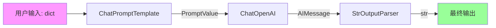
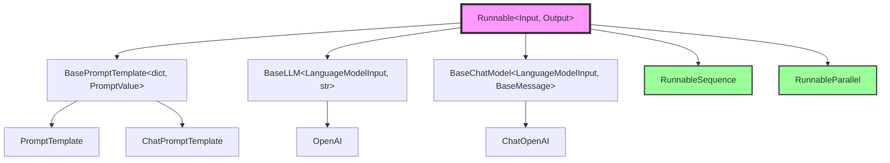

# 📚 模块 4-6：LangChain 完整执行流程总结

## 模块 4：LLM 实现

### 核心要点
`BaseLLM` 实现 `Runnable[LanguageModelInput, str]` 接口：

```python
class BaseLLM(RunnableSerializable[LanguageModelInput, str]):
    @abstractmethod
    def _generate(self, prompts: List[str], stop: List[str] | None = None) -> LLMResult:
        """核心生成方法"""
    
    def invoke(self, input: LanguageModelInput, config: RunnableConfig | None = None) -> str:
        """调用链：invoke → _generate_helper → _generate"""
```

**关键设计：**
- **输入类型**：`LanguageModelInput = str | List[BaseMessage] | PromptValue`
- **输出类型**：`str`（单个生成的文本）
- **批处理优化**：`_generate` 接受 `List[str]` 实现批处理
- **流式支持**：`_stream` 方法逐token返回

---

## 模块 5：ChatModel 实现

### 核心要点
`BaseChatModel` 实现 `Runnable[LanguageModelInput, BaseMessage]` 接口：

```python
class BaseChatModel(RunnableSerializable[LanguageModelInput, BaseMessage]):
    @abstractmethod
    def _generate(self, messages: List[BaseMessage], stop: List[str] | None = None) -> ChatResult:
        """核心生成方法"""
    
    def invoke(self, input: LanguageModelInput, config: RunnableConfig | None = None) -> BaseMessage:
        """调用链：invoke → _generate_with_cache → _generate"""
```

**关键设计：**
- **输入类型**：同 LLM，但优先处理消息列表
- **输出类型**：`BaseMessage`（通常是 `AIMessage`）
- **工具调用**：`bind_tools()` 方法绑定工具定义
- **结构化输出**：`with_structured_output()` 强制特定格式

**ChatModel vs LLM 对比：**

| 特性 | BaseLLM | BaseChatModel |
|------|---------|---------------|
| 输入 | 字符串提示 | 消息列表 |
| 输出 | 字符串 | BaseMessage |
| 工具调用 | ❌ | ✅ |
| 流式输出 | Token-by-token | Message chunks |

---

## 模块 6：LCEL 完整执行流程

### 完整链示例

```python
from langchain_core.prompts import ChatPromptTemplate
from langchain_openai import ChatOpenAI
from langchain_core.output_parsers import StrOutputParser

# 定义链
chain = (
    ChatPromptTemplate.from_template("Translate {text} to {language}")
    | ChatOpenAI(model="gpt-4")
    | StrOutputParser()
)

# 执行
result = chain.invoke({"text": "Hello", "language": "French"})
```

### 执行流程可视化



### 关键机制

**1. 类型自动转换**
```python
# 每个步骤的输出类型匹配下一步的输入类型：
# dict → PromptValue → AIMessage → str
```

**2. Config 传递**
```python
chain.invoke(
    {"text": "Hello", "language": "French"},
    config={
        "tags": ["translation"],
        "metadata": {"user_id": "123"},
        "callbacks": [ConsoleCallbackHandler()],
    }
)
# config 会传递给每个 Runnable
```

**3. 流式执行**
```python
for chunk in chain.stream({"text": "Hello", "language": "French"}):
    print(chunk, end="", flush=True)
# 输出: B o n j o u r
```

**4. 批处理**
```python
results = chain.batch([
    {"text": "Hello", "language": "French"},
    {"text": "Goodbye", "language": "Spanish"},
])
# results = ["Bonjour", "Adiós"]
```

### RunnableParallel（并行执行）

```python
from langchain_core.runnables import RunnableParallel

# 并行执行多个链
parallel_chain = RunnableParallel(
    french=ChatPromptTemplate.from_template("Translate {text} to French") | model,
    spanish=ChatPromptTemplate.from_template("Translate {text} to Spanish") | model,
)

result = parallel_chain.invoke({"text": "Hello"})
# result = {"french": AIMessage(...), "spanish": AIMessage(...)}
```

---

## 🎯 完整架构总结

### Runnable 生态系统



### 核心原则回顾

1. **统一接口**：所有组件都实现 `Runnable[Input, Output]`
2. **类型安全**：泛型系统确保组合的类型匹配
3. **自动能力**：实现 `invoke` 自动获得 `batch`/`stream`/`ainvoke`
4. **组合优先**：`|` 操作符无缝组合任意 Runnable
5. **可观测性**：Config 和 Callback 系统统一追踪

---

## 🧠 综合挑战

### 挑战 1：设计一个完整的 RAG 链

**需求**：设计一个检索增强生成（RAG）系统，包含：
1. 文档检索
2. 上下文注入
3. LLM 生成
4. 输出解析

**提示**：使用 `RunnableParallel` 和 `RunnablePassthrough`

### 挑战 2：实现自定义 Runnable

**任务**：创建一个 `TranslationCache` Runnable：
- 输入：`{"text": str, "language": str}`
- 输出：`str`（翻译结果）
- 逻辑：如果缓存命中返回缓存，否则调用 LLM

**要求**：
- 继承 `Runnable[dict, str]`
- 实现 `invoke` 方法
- 支持 `batch`（提示：利用默认实现或覆盖优化）

### 挑战 3：类型推导

给定以下 Runnable：
```python
A: Runnable[str, int]
B: Runnable[int, List[str]]
C: Runnable[List[str], dict]
D: Runnable[dict, str]

# 问题：
# 1. (A | B) 的类型是什么？
# 2. (A | B | C) 的类型是什么？
# 3. (A | B | C | D) 的类型是什么？
# 4. 如果尝试 (A | C)，会发生什么？
```

---

## ✅ 学习完成检查表

- [ ] 理解 `Runnable` 的核心契约（invoke/batch/stream）
- [ ] 理解 `RunnableSequence` 的扁平化机制
- [ ] 理解 `BasePromptTemplate` 的输入验证
- [ ] 理解 `BaseLLM` vs `BaseChatModel` 的区别
- [ ] 能够使用 `|` 操作符组合 Runnable
- [ ] 能够使用 `RunnableParallel` 并行执行
- [ ] 理解 Config 在链中的传递机制
- [ ] 能够实现自定义 Runnable

**恭喜！您已经完成 LangChain 核心源码的深度分析！** 🎉
