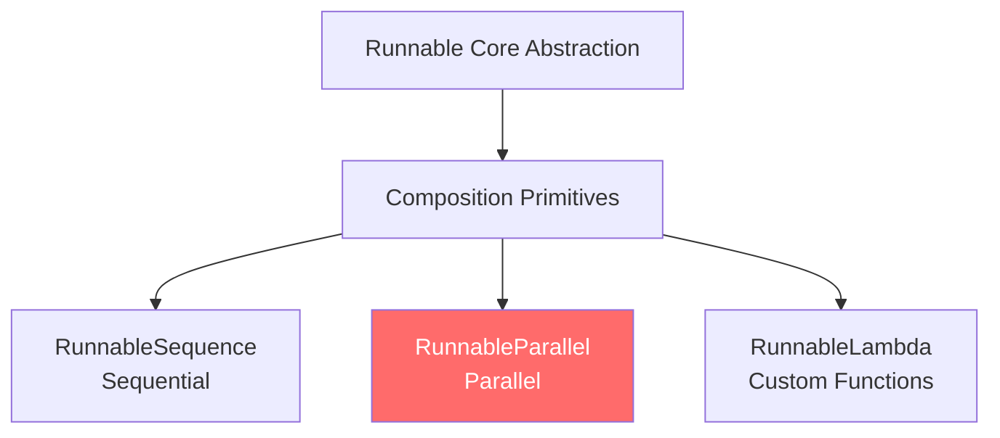
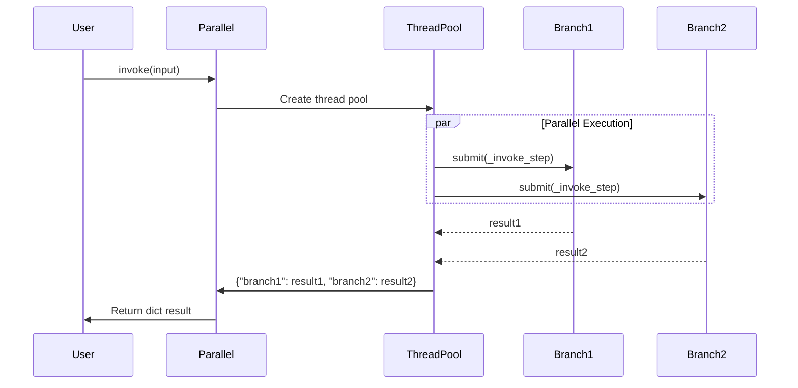

# Module 7: `RunnableParallel` - Deep Dive into Parallel Execution

> **Learning Objectives**
> - Understand the design philosophy and use cases of `RunnableParallel`
> - Master the internal implementation (thread pool vs async)
> - Learn how to improve performance and build complex data flows with parallelism

---

## 📍 Position in Overall Architecture



**Status:** `RunnableParallel` is one of the **two core composition primitives** alongside `RunnableSequence`, specialized for parallel branch execution.

---

## 🎯 Why Do We Need `RunnableParallel`?

### Problem 1: Concurrent Multi-Task Execution

Suppose you need to simultaneously:
- Generate article summary
- Translate article to French
- Extract keywords

**Sequential (Slow):**
```python
summary = summarize_chain.invoke(text)      # Wait 2s
translation = translate_chain.invoke(text)   # Wait 2s
keywords = extract_keywords.invoke(text)     # Wait 1s
# Total: 5 seconds
```

**Parallel (Fast):**
```python
parallel = RunnableParallel(
    summary=summarize_chain,
    translation=translate_chain,
    keywords=extract_keywords,
)
result = parallel.invoke(text)
# Total: max(2, 2, 1) = 2 seconds
```

### Problem 2: Building Complex Data Flows

RAG (Retrieval-Augmented Generation) pattern needs to:
1. Preserve the original question
2. Retrieve relevant documents simultaneously

```python
# Elegant implementation with RunnableParallel
rag_chain = (
    {
        "context": retriever,              # Branch 1: Retrieve docs
        "question": RunnablePassthrough()  # Branch 2: Preserve question
    }
    | prompt
    | model
)
```

---

## 🏗️ Source Code Deep-Dive

### 📄 File Location
**`libs/core/langchain_core/runnables/base.py:3537-3936`**

### 1️⃣ Class Definition and Core Attributes

```python
class RunnableParallel(RunnableSerializable[Input, dict[str, Any]]):
    """
    Runs multiple Runnables in parallel, providing the **same input** to each.
    Returns: Dictionary with branch names as keys and outputs as values.
    """

    steps__: Mapping[str, Runnable[Input, Any]]
    # Stores all parallel branches
```

**Key Points:**
- Input type: `Input` (shared by all branches)
- Output type: `dict[str, Any]` (dictionary form)
- Branch storage: `steps__` dictionary

---

### 2️⃣ Initialization: Three Creation Methods

#### Method 1: Dict Syntax (Recommended)

```python
parallel = {
    "add": RunnableLambda(lambda x: x + 10),
    "multiply": RunnableLambda(lambda x: x * 2),
}
```

**Source Implementation:** `libs/core/langchain_core/runnables/base.py:3623-3647`

```python
def __init__(
    self,
    steps__: Mapping[str, Runnable[Input, Any] | Callable] | None = None,
    **kwargs: Runnable[Input, Any] | Callable,
) -> None:
    # Merge steps__ and kwargs
    merged = {**steps__} if steps__ is not None else {}
    merged.update(kwargs)

    # Coerce all values to Runnables
    super().__init__(
        steps__={key: coerce_to_runnable(r) for key, r in merged.items()}
    )
```

**Key Design:**
1. **`coerce_to_runnable()`**: Auto-converts plain functions to `RunnableLambda`
2. **Flexibility**: Supports both `steps__` parameter and `**kwargs`

#### Method 2: Explicit Construction

```python
parallel = RunnableParallel(
    {"branch1": runnable1, "branch2": runnable2}
)
```

#### Method 3: Keyword Arguments

```python
parallel = RunnableParallel(
    branch1=runnable1,
    branch2=runnable2
)
```

---

### 3️⃣ Core Method: `invoke()` - Parallel Execution

**Source Location:** `libs/core/langchain_core/runnables/base.py:3806-3863`

```python
def invoke(
    self, input: Input, config: RunnableConfig | None = None, **kwargs: Any
) -> dict[str, Any]:
    # 1. Setup callbacks
    config = ensure_config(config)
    callback_manager = CallbackManager.configure(...)
    run_manager = callback_manager.on_chain_start(...)

    # 2. Define single-step execution
    def _invoke_step(step, input_, config, key):
        child_config = patch_config(
            config,
            callbacks=run_manager.get_child(f"map:key:{key}"),
        )
        return step.invoke(input_, child_config)

    try:
        # 3. Copy steps to avoid concurrent modification
        steps = dict(self.steps__)

        # 4. Execute in parallel using thread pool
        with get_executor_for_config(config) as executor:
            futures = [
                executor.submit(_invoke_step, step, input, config, key)
                for key, step in steps.items()
            ]

            # 5. Collect results
            output = {
                key: future.result()
                for key, future in zip(steps, futures, strict=False)
            }

    except BaseException as e:
        run_manager.on_chain_error(e)
        raise
    else:
        run_manager.on_chain_end(output)
        return output
```

**Execution Flow:**



**Key Design Points:**

| Design Point | Implementation | Purpose |
|--------------|----------------|---------|
| **Thread Pool** | `get_executor_for_config(config)` | CPU-bound task parallelism |
| **Child Callbacks** | `run_manager.get_child(f"map:key:{key}")` | Track each branch execution |
| **Shallow Copy** | `steps = dict(self.steps__)` | Prevent concurrent modification |
| **Exception Handling** | `try-except-else` | Ensure callbacks fire correctly |

---

### 4️⃣ Async Method: `ainvoke()` - True Concurrency

**Source Location:** `libs/core/langchain_core/runnables/base.py:3866-3918`

```python
async def ainvoke(
    self,
    input: Input,
    config: RunnableConfig | None = None,
    **kwargs: Any,
) -> dict[str, Any]:
    # Setup async callbacks
    config = ensure_config(config)
    callback_manager = get_async_callback_manager_for_config(config)
    run_manager = await callback_manager.on_chain_start(...)

    async def _ainvoke_step(step, input_, config, key):
        child_config = patch_config(config, callbacks=run_manager.get_child(f"map:key:{key}"))
        return await coro_with_context(
            step.ainvoke(input_, child_config),
            context,
            create_task=True
        )

    try:
        steps = dict(self.steps__)

        # Use asyncio.gather for true concurrency
        results = await asyncio.gather(
            *(_ainvoke_step(step, input, config, key) for key, step in steps.items())
        )

        output = dict(zip(steps, results, strict=False))
    except BaseException as e:
        await run_manager.on_chain_error(e)
        raise
    else:
        await run_manager.on_chain_end(output)
        return output
```

**`invoke()` vs `ainvoke()` Comparison:**

| Feature | `invoke()` | `ainvoke()` |
|---------|------------|-------------|
| **Parallelism** | Thread pool (`ThreadPoolExecutor`) | Async coroutines (`asyncio.gather`) |
| **Use Case** | I/O-bound (network, API calls) | Async I/O (async HTTP, async DB) |
| **Concurrency** | OS-level threads | Event loop coroutines |
| **Overhead** | Higher (thread switching) | Lower (coroutine switching) |

---

## 🧩 Real-World Application Patterns

### Pattern 1: RAG (Retrieval-Augmented Generation)

```python
from langchain_core.runnables import RunnableParallel, RunnablePassthrough

rag_chain = (
    # Parallel stage: Retrieve + preserve question
    RunnableParallel(
        context=retriever,
        question=RunnablePassthrough()
    )
    # Sequential stage: Prompt -> Model -> Parse
    | ChatPromptTemplate.from_template(
        "Context: {context}\n\nQuestion: {question}\n\nAnswer:"
    )
    | model
    | StrOutputParser()
)

result = rag_chain.invoke("What is LangChain?")
```

**Flow Diagram:**
```
Input: "What is LangChain?"
    ↓
RunnableParallel
    ├→ retriever       → ["LangChain is...", "It helps..."]
    └→ RunnablePassthrough → "What is LangChain?"
    ↓
{"context": [...], "question": "..."}
    ↓
ChatPromptTemplate → [HumanMessage("Context: ...\n\nQuestion: ...")]
    ↓
model → AIMessage("LangChain is a framework...")
    ↓
StrOutputParser → "LangChain is a framework..."
```

### Pattern 2: Multi-Model Comparison

```python
comparison_chain = RunnableParallel(
    claude=claude_prompt | claude_model | parser,
    gpt=gpt_prompt | gpt_model | parser,
    llama=llama_prompt | llama_model | parser,
)

results = comparison_chain.invoke({"topic": "AI ethics"})
# {
#     "claude": "Claude's response...",
#     "gpt": "GPT's response...",
#     "llama": "Llama's response..."
# }
```

### Pattern 3: Nested Parallel

```python
# Outer: Different types of analysis
outer_parallel = RunnableParallel(
    sentiment=sentiment_chain,

    # Inner: Multiple entity recognition models in parallel
    entities=RunnableParallel(
        spacy_entities=spacy_ner,
        transformers_entities=transformers_ner,
    ),

    summary=summarization_chain,
)
```

---

## 🧠 Knowledge Check

### Question 1: Output Type
```python
parallel = RunnableParallel(
    double=RunnableLambda(lambda x: x * 2),
    square=RunnableLambda(lambda x: x ** 2),
)
result = parallel.invoke(3)
```
**What is the value and type of `result`?**

<details>
<summary>Answer</summary>

**Value:** `{"double": 6, "square": 9}`
**Type:** `dict[str, Any]`

**Explanation:** `RunnableParallel` always returns a dictionary with branch names as keys.
</details>

### Question 2: Execution Order
```python
def log_and_return(name):
    def fn(x):
        print(f"{name}: {x}")
        time.sleep(1)
        return x * 2
    return RunnableLambda(fn)

parallel = RunnableParallel(
    a=log_and_return("A"),
    b=log_and_return("B"),
    c=log_and_return("C"),
)
parallel.invoke(5)
```
**Is the print order deterministic? What's the total time?**

<details>
<summary>Answer</summary>

**Print Order:** Non-deterministic (concurrent execution, order depends on thread scheduling)
**Total Time:** ~1 second (parallel execution, time = max of all branches)

**Explanation:** Three branches execute concurrently in the thread pool.
</details>

---

## 📚 Related Links

- **Previous Module:** [Module 2 - RunnableSequence](module-02-runnable-sequence-EN.md)
- **Next Module:** [Module 8 - RunnableLambda](module-08-runnable-lambda-EN.md)
- **Code Examples:** [examples/03_runnable_parallel.py](examples/03_runnable_parallel.py)
- **Glossary:** [GLOSSARY.md](GLOSSARY.md#runnableparallel--并行可运行组件)

---

**Progress:** ✅ Completed Runnable Core, RunnableSequence, RunnableParallel

**Next Step:** Learn `RunnableLambda` - How to integrate arbitrary Python functions into LCEL chains
