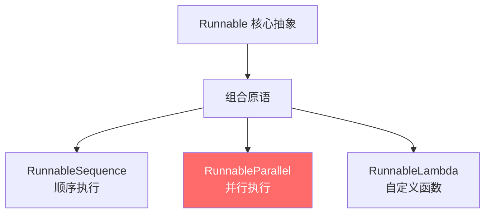
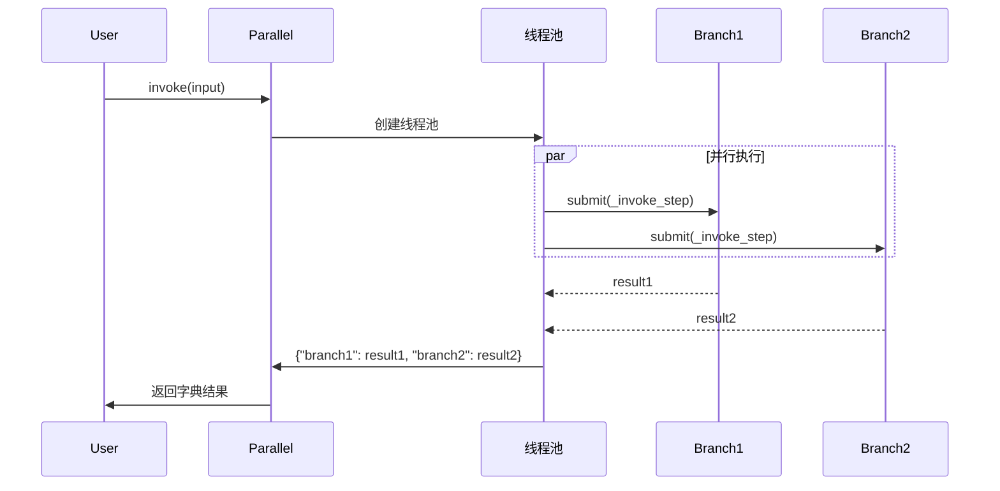

# 模块 7：`RunnableParallel` - 并行执行深度剖析

> **学习目标**
> - 理解 `RunnableParallel` 的设计思想和使用场景
> - 掌握并行执行的内部实现机制（线程池 vs 异步）
> - 学习如何通过并行提升性能和构建复杂数据流

---

## 📍 本模块在整体架构中的位置



**地位说明：** `RunnableParallel` 是与 `RunnableSequence` 并列的**两大核心组合原语之一**，专门用于并行执行多个分支。

---

## 🎯 为什么需要 `RunnableParallel`？

### 问题 1：多任务并行执行

假设你需要同时：
- 生成文章摘要
- 翻译文章到法语
- 提取关键词

**串行执行（慢）：**
```python
summary = summarize_chain.invoke(text)      # 等待 2 秒
translation = translate_chain.invoke(text)   # 等待 2 秒
keywords = extract_keywords.invoke(text)     # 等待 1 秒
# 总耗时：5 秒
```

**并行执行（快）：**
```python
parallel = RunnableParallel(
    summary=summarize_chain,
    translation=translate_chain,
    keywords=extract_keywords,
)
result = parallel.invoke(text)
# 总耗时：max(2, 2, 1) = 2 秒
```

### 问题 2：构建复杂数据流

RAG（检索增强生成）模式需要：
1. 保留原始问题
2. 同时检索相关文档

```python
# 使用 RunnableParallel 优雅实现
rag_chain = (
    {
        "context": retriever,              # 分支 1：检索文档
        "question": RunnablePassthrough()  # 分支 2：保留原始问题
    }
    | prompt
    | model
)
```

---

## 🏗️ 源码深度解析

### 📄 文件位置
**`libs/core/langchain_core/runnables/base.py:3537-3936`**

### 1️⃣ 类定义与核心属性

```python
class RunnableParallel(RunnableSerializable[Input, dict[str, Any]]):
    """
    并行运行多个 Runnable，所有分支接收**相同的输入**。
    返回值：字典，键为分支名，值为各分支的输出。
    """

    steps__: Mapping[str, Runnable[Input, Any]]
    # 存储所有并行分支，键为分支名，值为 Runnable 对象
```

**关键点：**
- 输入类型：`Input`（所有分支共享）
- 输出类型：`dict[str, Any]`（字典形式）
- 分支存储：`steps__` 字典

---

### 2️⃣ 初始化：三种创建方式

#### 方式 1：使用字典语法（推荐）

```python
parallel = {
    "add": RunnableLambda(lambda x: x + 10),
    "multiply": RunnableLambda(lambda x: x * 2),
}
```

**源码实现：** `libs/core/langchain_core/runnables/base.py:3623-3647`

```python
def __init__(
    self,
    steps__: Mapping[str, Runnable[Input, Any] | Callable] | None = None,
    **kwargs: Runnable[Input, Any] | Callable,
) -> None:
    # 合并 steps__ 和 kwargs
    merged = {**steps__} if steps__ is not None else {}
    merged.update(kwargs)

    # 将所有值强制转换为 Runnable
    super().__init__(
        steps__={key: coerce_to_runnable(r) for key, r in merged.items()}
    )
```

**关键设计：**
1. **`coerce_to_runnable()`**：自动将普通函数转换为 `RunnableLambda`
2. **灵活性**：支持 `steps__` 参数 + `**kwargs` 两种传参方式

#### 方式 2：显式构造

```python
parallel = RunnableParallel(
    {"branch1": runnable1, "branch2": runnable2}
)
```

#### 方式 3：关键字参数

```python
parallel = RunnableParallel(
    branch1=runnable1,
    branch2=runnable2
)
```

---

### 3️⃣ 核心方法：`invoke()` - 并行执行

**源码位置：** `libs/core/langchain_core/runnables/base.py:3806-3863`

```python
def invoke(
    self, input: Input, config: RunnableConfig | None = None, **kwargs: Any
) -> dict[str, Any]:
    # 1. 设置回调管理器
    config = ensure_config(config)
    callback_manager = CallbackManager.configure(...)
    run_manager = callback_manager.on_chain_start(...)

    # 2. 定义单步执行函数
    def _invoke_step(step: Runnable, input_: Input, config: RunnableConfig, key: str):
        child_config = patch_config(
            config,
            callbacks=run_manager.get_child(f"map:key:{key}"),  # 子回调
        )
        return step.invoke(input_, child_config)

    try:
        # 3. 复制 steps 避免并发修改问题
        steps = dict(self.steps__)

        # 4. 使用线程池并行执行
        with get_executor_for_config(config) as executor:
            futures = [
                executor.submit(_invoke_step, step, input, config, key)
                for key, step in steps.items()
            ]

            # 5. 收集结果
            output = {
                key: future.result()
                for key, future in zip(steps, futures, strict=False)
            }

    except BaseException as e:
        run_manager.on_chain_error(e)
        raise
    else:
        run_manager.on_chain_end(output)
        return output
```

**执行流程图：**



**关键设计点：**

| 设计点 | 实现方式 | 目的 |
|--------|----------|------|
| **线程池执行** | `get_executor_for_config(config)` | CPU 密集型任务并行 |
| **子回调** | `run_manager.get_child(f"map:key:{key}")` | 追踪每个分支的执行 |
| **浅拷贝** | `steps = dict(self.steps__)` | 防止并发修改 |
| **异常处理** | `try-except-else` | 确保回调正确触发 |

---

### 4️⃣ 异步方法：`ainvoke()` - 真正的并发

**源码位置：** `libs/core/langchain_core/runnables/base.py:3866-3918`

```python
async def ainvoke(
    self,
    input: Input,
    config: RunnableConfig | None = None,
    **kwargs: Any,
) -> dict[str, Any]:
    # 设置异步回调
    config = ensure_config(config)
    callback_manager = get_async_callback_manager_for_config(config)
    run_manager = await callback_manager.on_chain_start(...)

    async def _ainvoke_step(step, input_, config, key):
        child_config = patch_config(config, callbacks=run_manager.get_child(f"map:key:{key}"))
        return await coro_with_context(
            step.ainvoke(input_, child_config),
            context,
            create_task=True
        )

    try:
        steps = dict(self.steps__)

        # 使用 asyncio.gather 真正的并发执行
        results = await asyncio.gather(
            *(_ainvoke_step(step, input, config, key) for key, step in steps.items())
        )

        output = dict(zip(steps, results, strict=False))
    except BaseException as e:
        await run_manager.on_chain_error(e)
        raise
    else:
        await run_manager.on_chain_end(output)
        return output
```

**`invoke()` vs `ainvoke()` 对比：**

| 特性 | `invoke()` | `ainvoke()` |
|------|------------|-------------|
| **并行方式** | 线程池（`ThreadPoolExecutor`） | 异步协程（`asyncio.gather`） |
| **适用场景** | I/O 密集型（网络请求、API 调用） | 异步 I/O（async HTTP、async DB） |
| **并发粒度** | 进程级线程 | 事件循环协程 |
| **开销** | 较高（线程切换） | 低（协程切换） |

---

### 5️⃣ 类型安全：输入输出模式推断

**源码位置：** `libs/core/langchain_core/runnables/base.py:3694-3743`

#### 输入模式推断

```python
def get_input_schema(self, config: RunnableConfig | None = None) -> type[BaseModel]:
    # 如果所有分支的输入都是对象类型
    if all(
        s.get_input_schema(config).model_json_schema().get("type") == "object"
        for s in self.steps__.values()
    ):
        # 合并所有分支的输入字段
        return create_model_v2(
            self.get_name("Input"),
            field_definitions={
                k: (v.annotation, v.default)
                for step in self.steps__.values()
                for k, v in step.get_input_schema(config).model_fields.items()
                if k != "__root__"
            },
        )

    return super().get_input_schema(config)
```

**示例：**
```python
parallel = RunnableParallel(
    add=RunnableLambda(lambda x: x["a"] + x["b"]),     # 需要 a, b
    multiply=RunnableLambda(lambda x: x["a"] * x["c"]), # 需要 a, c
)

# 自动推断输入模式：{"a": int, "b": int, "c": int}
```

#### 输出模式推断

```python
def get_output_schema(self, config: RunnableConfig | None = None) -> type[BaseModel]:
    # 输出：每个分支的输出类型
    fields = {k: (v.OutputType, ...) for k, v in self.steps__.items()}
    return create_model_v2(self.get_name("Output"), field_definitions=fields)
```

**示例：**
```python
# 输出模式：{"add": int, "multiply": int}
```

---

## 🧩 实战应用模式

### 模式 1：RAG 检索增强生成

```python
from langchain_core.runnables import RunnableParallel, RunnablePassthrough

rag_chain = (
    # 并行阶段：检索 + 保留原始问题
    RunnableParallel(
        context=retriever,  # 检索相关文档
        question=RunnablePassthrough()  # 透传原始问题
    )
    # 顺序阶段：组合成提示 -> 调用模型 -> 解析输出
    | ChatPromptTemplate.from_template(
        "Context: {context}\n\nQuestion: {question}\n\nAnswer:"
    )
    | model
    | StrOutputParser()
)

result = rag_chain.invoke("What is LangChain?")
```

**流程图：**
```
输入: "What is LangChain?"
    ↓
RunnableParallel
    ├→ retriever       → ["LangChain is...", "It helps..."]
    └→ RunnablePassthrough → "What is LangChain?"
    ↓
{"context": [...], "question": "..."}
    ↓
ChatPromptTemplate → [HumanMessage("Context: ...\n\nQuestion: ...")]
    ↓
model → AIMessage("LangChain is a framework...")
    ↓
StrOutputParser → "LangChain is a framework..."
```

### 模式 2：多模型对比

```python
comparison_chain = RunnableParallel(
    claude=claude_prompt | claude_model | parser,
    gpt=gpt_prompt | gpt_model | parser,
    llama=llama_prompt | llama_model | parser,
)

results = comparison_chain.invoke({"topic": "AI ethics"})
# {
#     "claude": "Claude's response...",
#     "gpt": "GPT's response...",
#     "llama": "Llama's response..."
# }
```

### 模式 3：嵌套并行

```python
# 外层：不同类型的分析
outer_parallel = RunnableParallel(
    sentiment=sentiment_chain,

    # 内层：多个实体识别模型并行
    entities=RunnableParallel(
        spacy_entities=spacy_ner,
        transformers_entities=transformers_ner,
    ),

    summary=summarization_chain,
)
```

**数据流：**
```
Input: "Apple released new iPhone..."
    ↓
┌─────────────────────────────────┐
│  OuterParallel                  │
│  ├─ sentiment                   │
│  ├─ entities (InnerParallel)    │
│  │   ├─ spacy_entities          │
│  │   └─ transformers_entities   │
│  └─ summary                     │
└─────────────────────────────────┘
    ↓
{
    "sentiment": "positive",
    "entities": {
        "spacy_entities": ["Apple", "iPhone"],
        "transformers_entities": ["Apple Inc.", "iPhone 15"]
    },
    "summary": "Apple announced..."
}
```

---

## 🔍 设计哲学与权衡

### ✅ 优点

1. **性能提升**
   - I/O 密集型任务：线程池并行（`invoke()`）
   - 异步任务：协程并发（`ainvoke()`）

2. **简洁语法**
   - 字典语法：`{"key": runnable}` 自动创建 `RunnableParallel`
   - 无需手动管理线程或协程

3. **统一接口**
   - 仍然是 `Runnable`，支持 `invoke()`、`batch()`、`stream()` 等

4. **可组合性**
   - 可嵌套在 `RunnableSequence` 中
   - 可作为其他 `RunnableParallel` 的分支

### ⚠️ 注意事项

1. **共享输入**
   - 所有分支接收**完全相同**的输入
   - 如需不同输入，使用 `RunnableLambda` 预处理

2. **并发安全**
   - 避免修改可变共享状态
   - 源码通过 `dict(self.steps__)` 浅拷贝避免并发修改

3. **性能考量**
   - CPU 密集型任务：线程池受 GIL 限制，考虑进程池
   - 分支过多：线程/协程开销可能抵消收益

4. **错误处理**
   - 任一分支失败会导致整个 `invoke()` 失败
   - 需要在分支内部处理异常或使用 `with_fallbacks()`

---

## 🧠 知识检验

### 问题 1：输出类型
```python
parallel = RunnableParallel(
    double=RunnableLambda(lambda x: x * 2),
    square=RunnableLambda(lambda x: x ** 2),
)
result = parallel.invoke(3)
```
**`result` 的值和类型是什么？**

<details>
<summary>答案</summary>

**值：** `{"double": 6, "square": 9}`
**类型：** `dict[str, Any]`

**解释：** `RunnableParallel` 总是返回字典，键为分支名，值为各分支输出。
</details>

### 问题 2：执行顺序
```python
def log_and_return(name):
    def fn(x):
        print(f"{name}: {x}")
        time.sleep(1)
        return x * 2
    return RunnableLambda(fn)

parallel = RunnableParallel(
    a=log_and_return("A"),
    b=log_and_return("B"),
    c=log_and_return("C"),
)
parallel.invoke(5)
```
**打印顺序是固定的吗？总耗时是多少？**

<details>
<summary>答案</summary>

**打印顺序：** 不固定（并发执行，顺序不确定）
**总耗时：** 约 1 秒（并行执行，耗时 = max(各分支耗时)）

**解释：** 三个分支在线程池中并发执行，打印顺序取决于线程调度。
</details>

### 问题 3：实现 RAG
**任务：** 使用 `RunnableParallel` 实现以下 RAG 流程：
1. 输入用户问题
2. 并行执行：
   - 检索 top-3 文档（用 `mock_retriever` 模拟）
   - 保留原始问题
3. 将结果传递给下游

<details>
<summary>答案</summary>

```python
from langchain_core.runnables import RunnableParallel, RunnablePassthrough, RunnableLambda

def mock_retriever(question):
    """模拟检索器"""
    return ["Doc1: LangChain is...", "Doc2: LCEL means...", "Doc3: Runnable is..."]

rag_parallel = RunnableParallel(
    context=RunnableLambda(mock_retriever),
    question=RunnablePassthrough()
)

result = rag_parallel.invoke("What is LangChain?")
# {
#     "context": ["Doc1: ...", "Doc2: ...", "Doc3: ..."],
#     "question": "What is LangChain?"
# }
```

**关键点：**
- `RunnablePassthrough()`：保留原始输入
- `RunnableLambda(mock_retriever)`：包装普通函数为 Runnable
</details>

---

## 📚 相关链接

- **前置模块：** [模块 2 - RunnableSequence](module-02-runnable-sequence-ZH.md)
- **下一模块：** [模块 8 - RunnableLambda](module-08-runnable-lambda-ZH.md)
- **代码示例：** [examples/03_runnable_parallel.py](examples/03_runnable_parallel.py)
- **术语表：** [GLOSSARY.md](GLOSSARY.md#runnableparallel--并行可运行组件)

---

**学习进度：** ✅ 已完成 Runnable 核心抽象、RunnableSequence、RunnableParallel

**下一步：** 学习 `RunnableLambda` - 如何将任意 Python 函数集成到 LCEL 链中
