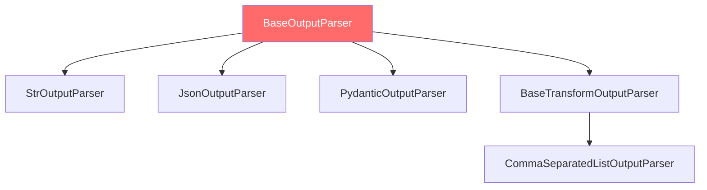

# Module 9: `OutputParser` - Structured Output Parsing

> **Learning Objectives**
> - Understand the role and type hierarchy of OutputParser
> - Master StrOutputParser, JsonOutputParser, and PydanticOutputParser
> - Learn how to create custom OutputParsers

---

## 📍 Core Purpose

`OutputParser` transforms LLM raw output (typically `AIMessage`) into structured formats:
- **String extraction**: `AIMessage` → `str`
- **JSON parsing**: `str` → `dict`
- **Type validation**: `str` → Pydantic model
- **Custom transformation**: Arbitrary format conversion logic

---

## 🏗️ OutputParser Type Hierarchy



**Core Interface:**
```python
class BaseOutputParser(RunnableSerializable[Union[str, BaseMessage], T], ABC):
    """Abstract base class for output parsers"""

    @abstractmethod
    def parse(self, text: str) -> T:
        """Parse output from string"""

    def parse_result(self, result: List[Generation]) -> T:
        """Parse from LLM generation result"""
        return self.parse(result[0].text)

    def invoke(self, input: Union[str, BaseMessage], config: RunnableConfig = None) -> T:
        """Runnable interface implementation"""
        if isinstance(input, BaseMessage):
            return self.parse(input.content)
        else:
            return self.parse(input)
```

---

## 🔧 Common OutputParsers Explained

### 1️⃣ `StrOutputParser` - String Extractor

**Purpose:** Extract plain text content from `AIMessage`

**Source:** `libs/core/langchain_core/output_parsers/string.py`

```python
class StrOutputParser(BaseOutputParser[str]):
    """Extract .content field from AIMessage"""

    def parse(self, text: str) -> str:
        """Return text directly"""
        return text

    def invoke(self, input: Union[str, BaseMessage], config: RunnableConfig = None) -> str:
        if isinstance(input, BaseMessage):
            return input.content  # Extract content
        return input
```

**Usage Example:**
```python
from langchain_core.output_parsers import StrOutputParser

chain = prompt | model | StrOutputParser()

result = chain.invoke({"topic": "AI"})
# Type: str (not AIMessage)
print(result)  # "Artificial Intelligence is..."
```

**Use Cases:**
- Most commonly used parser
- Simplify chain output type
- Facilitate subsequent string processing

---

### 2️⃣ `JsonOutputParser` - JSON Parser

**Purpose:** Parse JSON string from LLM output into Python dictionary

**Source:** `libs/core/langchain_core/output_parsers/json.py`

```python
class JsonOutputParser(BaseOutputParser[Any]):
    """Parse JSON-formatted output"""

    pydantic_object: Type[BaseModel] | None = None  # Optional Pydantic model

    def parse(self, text: str) -> Any:
        """Parse JSON string"""
        text = text.strip()
        # Clean markdown code blocks
        if text.startswith("```json"):
            text = text[len("```json"):].strip()
        if text.endswith("```"):
            text = text[:-len("```")].strip()

        try:
            return json.loads(text)
        except json.JSONDecodeError as e:
            raise OutputParserException(f"Invalid JSON: {e}")
```

**Usage Example:**
```python
from langchain_core.output_parsers import JsonOutputParser

prompt = ChatPromptTemplate.from_template(
    "Output JSON with keys 'name' and 'age' for: {person}. "
    "Format: {format_instructions}"
)

parser = JsonOutputParser()

chain = prompt.partial(format_instructions=parser.get_format_instructions()) | model | parser

result = chain.invoke({"person": "a 30-year-old named Alice"})
# Type: dict
print(result)  # {"name": "Alice", "age": 30}
```

---

### 3️⃣ `PydanticOutputParser` - Type-Safe Parser

**Purpose:** Parse LLM output into Pydantic model with type validation

**Source:** `libs/core/langchain_core/output_parsers/pydantic.py`

```python
class PydanticOutputParser(BaseOutputParser[T]):
    """Parse into Pydantic model"""

    pydantic_object: Type[T]  # Pydantic model class

    def parse(self, text: str) -> T:
        """Parse and validate"""
        # 1. Parse JSON
        json_obj = json.loads(text)

        # 2. Validate and construct Pydantic model
        try:
            return self.pydantic_object.model_validate(json_obj)
        except ValidationError as e:
            raise OutputParserException(f"Invalid format: {e}")

    def get_format_instructions(self) -> str:
        """Generate format instructions (includes model schema)"""
        schema = self.pydantic_object.model_json_schema()
        return f"Output JSON matching this schema:\n{json.dumps(schema, indent=2)}"
```

**Usage Example:**
```python
from langchain_core.output_parsers import PydanticOutputParser
from pydantic import BaseModel, Field

class Person(BaseModel):
    name: str = Field(description="Person's name")
    age: int = Field(description="Person's age")
    occupation: str = Field(description="Person's job")

parser = PydanticOutputParser(pydantic_object=Person)

prompt = ChatPromptTemplate.from_template(
    "Extract person info: {text}\n\n{format_instructions}"
)

chain = prompt.partial(format_instructions=parser.get_format_instructions()) | model | parser

result = chain.invoke({"text": "Alice is a 30-year-old engineer"})
# Type: Person
print(result.name)       # "Alice" (type-safe)
print(result.age)        # 30 (validated as int)
print(result.occupation) # "engineer"
```

**Advantages:**
- ✅ **Type safety**: IDE auto-completion
- ✅ **Auto-validation**: Pydantic validates data format
- ✅ **Documentation generation**: `get_format_instructions()` auto-generates format instructions
- ✅ **Reusability**: Pydantic models can be reused elsewhere in code

---

### 4️⃣ `CommaSeparatedListOutputParser` - List Parser

**Purpose:** Parse comma-separated lists

```python
from langchain_core.output_parsers import CommaSeparatedListOutputParser

parser = CommaSeparatedListOutputParser()

prompt = ChatPromptTemplate.from_template(
    "List 5 {topic}. Output as comma-separated values."
)

chain = prompt | model | parser

result = chain.invoke({"topic": "programming languages"})
# Type: List[str]
print(result)  # ["Python", "JavaScript", "Java", "C++", "Rust"]
```

---

## 🛠️ Creating Custom OutputParsers

### Example: Code Block Extractor

```python
from langchain_core.output_parsers import BaseOutputParser
import re

class CodeBlockParser(BaseOutputParser[str]):
    """Extract code from Markdown code blocks"""

    language: str = "python"  # Specify language

    def parse(self, text: str) -> str:
        """Extract code from Markdown"""
        # Match ```python ... ```
        pattern = rf"```{self.language}\n(.*?)\n```"
        match = re.search(pattern, text, re.DOTALL)

        if match:
            return match.group(1).strip()
        else:
            raise OutputParserException(f"No {self.language} code block found")

    def get_format_instructions(self) -> str:
        return f"Output code in a ```{self.language} code block."

# Usage
parser = CodeBlockParser(language="python")

chain = prompt | model | parser

result = chain.invoke({"task": "write a function to add two numbers"})
# Returns pure code (without ``` markers)
print(result)
# def add(a, b):
#     return a + b
```

---

## 🧩 Real-World Patterns

### Pattern 1: Structured Data Extraction

```python
from pydantic import BaseModel

class Article(BaseModel):
    title: str
    summary: str
    keywords: List[str]
    sentiment: Literal["positive", "neutral", "negative"]

parser = PydanticOutputParser(pydantic_object=Article)

extraction_chain = (
    ChatPromptTemplate.from_template(
        "Analyze this article:\n{article}\n\n{format_instructions}"
    ).partial(format_instructions=parser.get_format_instructions())
    | model
    | parser
)

result = extraction_chain.invoke({"article": "..."})
# result.title, result.summary, result.keywords, result.sentiment
```

### Pattern 2: Multi-Step Parsing

```python
# Step 1: Extract JSON
json_parser = JsonOutputParser()

# Step 2: Validate and transform
def validate_output(data: dict) -> dict:
    if "confidence" not in data:
        data["confidence"] = 0.5  # Default value
    if data["confidence"] < 0.7:
        raise ValueError("Low confidence result")
    return data

chain = (
    prompt
    | model
    | json_parser
    | RunnableLambda(validate_output)
)
```

### Pattern 3: Error Recovery

```python
from langchain_core.output_parsers import OutputFixingParser

# Base parser
base_parser = PydanticOutputParser(pydantic_object=Person)

# Wrap with fixing parser
fixing_parser = OutputFixingParser.from_llm(
    parser=base_parser,
    llm=model,
    max_retries=3
)

chain = prompt | model | fixing_parser

# If output format is wrong, fixing_parser asks LLM to regenerate
```

---

## 🔍 OutputParser vs with_structured_output()

### OutputParser (Recommended for General Use)
```python
parser = PydanticOutputParser(pydantic_object=Person)
chain = prompt.partial(format_instructions=parser.get_format_instructions()) | model | parser
```
**Pros:**
- ✅ Compatible with any model
- ✅ Full control over format instructions
- ✅ Customizable parsing logic

**Cons:**
- ❌ Must manually add format instructions to prompt
- ❌ LLM may not follow format

### with_structured_output() (Native Model Support)
```python
structured_model = model.with_structured_output(Person)
chain = prompt | structured_model
```
**Pros:**
- ✅ Leverages model's native structured output capability (e.g., OpenAI function calling)
- ✅ Higher success rate
- ✅ No manual format instructions in prompt

**Cons:**
- ❌ Only supports certain models (OpenAI, Anthropic, etc.)
- ❌ Depends on model-specific API

**Selection Guide:**
- **Supported models**: Prefer `with_structured_output()`
- **Universal compatibility**: Use `PydanticOutputParser`

---

## 🧠 Knowledge Check

### Question 1: Parser Selection
**Scenario:** You need a simple string response from the LLM. Which parser should you use?

<details>
<summary>Answer</summary>

**Answer:** `StrOutputParser()`

**Reason:** Simplest scenario, only need to extract `AIMessage.content`.
</details>

### Question 2: Type Safety
**Which provides type-safe access?**
```python
# Option A
result = (prompt | model | JsonOutputParser()).invoke(input)
print(result["name"])

# Option B
result = (prompt | model | PydanticOutputParser(pydantic_object=Person)).invoke(input)
print(result.name)
```

<details>
<summary>Answer</summary>

**Answer:** Option B (`PydanticOutputParser`)

**Reason:**
- Option A: `result` is `dict`, no IDE auto-completion
- Option B: `result` is `Person`, with type hints and validation
</details>

---

## 📚 Related Links

- **Previous Module:** [Module 8 - RunnableLambda](module-08-runnable-lambda-EN.md)
- **Code Examples:** [examples/04_complete_chain.py](examples/04_complete_chain.py)
- **Glossary:** [GLOSSARY.md](GLOSSARY.md#outputparser--输出解析器)
- **FAQ:** [FAQ.md - Output Parsers](FAQ.md#outputparser)

---

**Progress:** ✅ Modules 1-9 All Completed!

**Key Takeaway:** OutputParser transforms LLM output from **unstructured text** to **type-safe data structures**!
