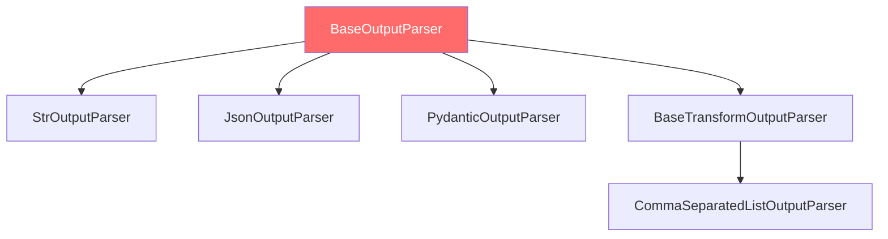

# 模块 9：`OutputParser` - 结构化输出解析

> **学习目标**
> - 理解 OutputParser 的作用和类型层次
> - 掌握 StrOutputParser、JsonOutputParser、PydanticOutputParser 的使用
> - 学习如何创建自定义 OutputParser

---

## 📍 核心作用

`OutputParser` 负责将 LLM 的原始输出（通常是 `AIMessage`）转换为结构化格式：
- **字符串提取**：`AIMessage` → `str`
- **JSON 解析**：`str` → `dict`
- **类型验证**：`str` → Pydantic 模型
- **自定义转换**：任意格式转换逻辑

---

## 🏗️ OutputParser 类型层次



**核心接口：**
```python
class BaseOutputParser(RunnableSerializable[Union[str, BaseMessage], T], ABC):
    """输出解析器的抽象基类"""

    @abstractmethod
    def parse(self, text: str) -> T:
        """从字符串解析输出"""

    def parse_result(self, result: List[Generation]) -> T:
        """从 LLM 生成结果解析"""
        return self.parse(result[0].text)

    def invoke(self, input: Union[str, BaseMessage], config: RunnableConfig = None) -> T:
        """Runnable 接口实现"""
        if isinstance(input, BaseMessage):
            return self.parse(input.content)
        else:
            return self.parse(input)
```

---

## 🔧 常用 OutputParser 详解

### 1️⃣ `StrOutputParser` - 字符串提取器

**用途：** 从 `AIMessage` 中提取纯文本内容

**源码位置：** `libs/core/langchain_core/output_parsers/string.py`

```python
class StrOutputParser(BaseOutputParser[str]):
    """从 AIMessage 提取 .content 字段"""

    def parse(self, text: str) -> str:
        """直接返回文本"""
        return text

    def invoke(self, input: Union[str, BaseMessage], config: RunnableConfig = None) -> str:
        if isinstance(input, BaseMessage):
            return input.content  # 提取 content
        return input
```

**使用示例：**
```python
from langchain_core.output_parsers import StrOutputParser

chain = prompt | model | StrOutputParser()

result = chain.invoke({"topic": "AI"})
# 类型: str (不是 AIMessage)
print(result)  # "Artificial Intelligence is..."
```

**适用场景：**
- 最常用的解析器
- 简化链的输出类型
- 便于后续字符串处理

---

### 2️⃣ `JsonOutputParser` - JSON 解析器

**用途：** 将 LLM 输出的 JSON 字符串解析为 Python 字典

**源码位置：** `libs/core/langchain_core/output_parsers/json.py`

```python
class JsonOutputParser(BaseOutputParser[Any]):
    """解析 JSON 格式的输出"""

    pydantic_object: Type[BaseModel] | None = None  # 可选的 Pydantic 模型

    def parse(self, text: str) -> Any:
        """解析 JSON 字符串"""
        text = text.strip()
        # 清理 markdown 代码块
        if text.startswith("```json"):
            text = text[len("```json"):].strip()
        if text.endswith("```"):
            text = text[:-len("```")].strip()

        try:
            return json.loads(text)
        except json.JSONDecodeError as e:
            raise OutputParserException(f"Invalid JSON: {e}")
```

**使用示例：**
```python
from langchain_core.output_parsers import JsonOutputParser

prompt = ChatPromptTemplate.from_template(
    "Output JSON with keys 'name' and 'age' for: {person}. "
    "Format: {format_instructions}"
)

parser = JsonOutputParser()

chain = prompt.partial(format_instructions=parser.get_format_instructions()) | model | parser

result = chain.invoke({"person": "a 30-year-old named Alice"})
# 类型: dict
print(result)  # {"name": "Alice", "age": 30}
```

**关键方法：**
```python
parser.get_format_instructions()
# 返回: "Output a valid JSON object."
```

---

### 3️⃣ `PydanticOutputParser` - 类型安全解析器

**用途：** 将 LLM 输出解析为 Pydantic 模型，提供类型验证

**源码位置：** `libs/core/langchain_core/output_parsers/pydantic.py`

```python
class PydanticOutputParser(BaseOutputParser[T]):
    """解析为 Pydantic 模型"""

    pydantic_object: Type[T]  # Pydantic 模型类

    def parse(self, text: str) -> T:
        """解析并验证"""
        # 1. 解析 JSON
        json_obj = json.loads(text)

        # 2. 验证并构造 Pydantic 模型
        try:
            return self.pydantic_object.model_validate(json_obj)
        except ValidationError as e:
            raise OutputParserException(f"Invalid format: {e}")

    def get_format_instructions(self) -> str:
        """生成格式说明（包含模型 schema）"""
        schema = self.pydantic_object.model_json_schema()
        return f"Output JSON matching this schema:\n{json.dumps(schema, indent=2)}"
```

**使用示例：**
```python
from langchain_core.output_parsers import PydanticOutputParser
from pydantic import BaseModel, Field

class Person(BaseModel):
    name: str = Field(description="Person's name")
    age: int = Field(description="Person's age")
    occupation: str = Field(description="Person's job")

parser = PydanticOutputParser(pydantic_object=Person)

prompt = ChatPromptTemplate.from_template(
    "Extract person info: {text}\n\n{format_instructions}"
)

chain = prompt.partial(format_instructions=parser.get_format_instructions()) | model | parser

result = chain.invoke({"text": "Alice is a 30-year-old engineer"})
# 类型: Person
print(result.name)       # "Alice" (类型安全)
print(result.age)        # 30 (验证为 int)
print(result.occupation) # "engineer"
```

**优势：**
- ✅ **类型安全**：IDE 自动补全
- ✅ **自动验证**：Pydantic 验证数据格式
- ✅ **文档生成**：`get_format_instructions()` 自动生成格式说明
- ✅ **重用性**：Pydantic 模型可在代码其他部分重用

---

### 4️⃣ `CommaSeparatedListOutputParser` - 列表解析器

**用途：** 解析逗号分隔的列表

```python
from langchain_core.output_parsers import CommaSeparatedListOutputParser

parser = CommaSeparatedListOutputParser()

prompt = ChatPromptTemplate.from_template(
    "List 5 {topic}. Output as comma-separated values."
)

chain = prompt | model | parser

result = chain.invoke({"topic": "programming languages"})
# 类型: List[str]
print(result)  # ["Python", "JavaScript", "Java", "C++", "Rust"]
```

---

## 🛠️ 创建自定义 OutputParser

### 示例：提取代码块

```python
from langchain_core.output_parsers import BaseOutputParser
import re

class CodeBlockParser(BaseOutputParser[str]):
    """提取 Markdown 代码块中的代码"""

    language: str = "python"  # 指定语言

    def parse(self, text: str) -> str:
        """从 Markdown 中提取代码"""
        # 匹配 ```python ... ```
        pattern = rf"```{self.language}\n(.*?)\n```"
        match = re.search(pattern, text, re.DOTALL)

        if match:
            return match.group(1).strip()
        else:
            raise OutputParserException(f"No {self.language} code block found")

    def get_format_instructions(self) -> str:
        return f"Output code in a ```{self.language} code block."

# 使用
parser = CodeBlockParser(language="python")

chain = prompt | model | parser

result = chain.invoke({"task": "write a function to add two numbers"})
# 返回纯代码（不包含 ``` 标记）
print(result)
# def add(a, b):
#     return a + b
```

---

## 🧩 实战模式

### 模式 1：结构化数据提取

```python
from pydantic import BaseModel

class Article(BaseModel):
    title: str
    summary: str
    keywords: List[str]
    sentiment: Literal["positive", "neutral", "negative"]

parser = PydanticOutputParser(pydantic_object=Article)

extraction_chain = (
    ChatPromptTemplate.from_template(
        "Analyze this article:\n{article}\n\n{format_instructions}"
    ).partial(format_instructions=parser.get_format_instructions())
    | model
    | parser
)

result = extraction_chain.invoke({"article": "..."})
# result.title, result.summary, result.keywords, result.sentiment
```

### 模式 2：多步骤解析

```python
# 第一步：提取 JSON
json_parser = JsonOutputParser()

# 第二步：验证并转换
def validate_output(data: dict) -> dict:
    if "confidence" not in data:
        data["confidence"] = 0.5  # 默认值
    if data["confidence"] < 0.7:
        raise ValueError("Low confidence result")
    return data

chain = (
    prompt
    | model
    | json_parser
    | RunnableLambda(validate_output)
)
```

### 模式 3：错误恢复

```python
from langchain_core.output_parsers import OutputFixingParser

# 基础解析器
base_parser = PydanticOutputParser(pydantic_object=Person)

# 包装为修复解析器
fixing_parser = OutputFixingParser.from_llm(
    parser=base_parser,
    llm=model,
    max_retries=3
)

chain = prompt | model | fixing_parser

# 如果输出格式错误，fixing_parser 会要求 LLM 重新生成
```

---

## 🔍 OutputParser vs with_structured_output()

### OutputParser（推荐用于通用场景）
```python
parser = PydanticOutputParser(pydantic_object=Person)
chain = prompt.partial(format_instructions=parser.get_format_instructions()) | model | parser
```
**优点：**
- ✅ 与任何模型兼容
- ✅ 完全控制格式说明
- ✅ 可自定义解析逻辑

**缺点：**
- ❌ 需要在 prompt 中手动添加格式说明
- ❌ LLM 可能不遵循格式

### with_structured_output()（模型原生支持）
```python
structured_model = model.with_structured_output(Person)
chain = prompt | structured_model
```
**优点：**
- ✅ 利用模型的原生结构化输出能力（如 OpenAI 的函数调用）
- ✅ 更高的成功率
- ✅ 无需在 prompt 中手动添加格式说明

**缺点：**
- ❌ 仅支持部分模型（OpenAI、Anthropic 等）
- ❌ 依赖模型特定 API

**选择建议：**
- **支持的模型**：优先使用 `with_structured_output()`
- **通用兼容性**：使用 `PydanticOutputParser`

---

## 🧠 知识检验

### 问题 1：解析器选择
**场景：** 你需要从 LLM 获取一个简单的字符串响应。应该使用哪个解析器？

<details>
<summary>答案</summary>

**答案：** `StrOutputParser()`

**理由：** 最简单的场景，只需提取 `AIMessage.content`。
</details>

### 问题 2：类型安全
**以下哪个提供类型安全的访问？**
```python
# 选项 A
result = (prompt | model | JsonOutputParser()).invoke(input)
print(result["name"])

# 选项 B
result = (prompt | model | PydanticOutputParser(pydantic_object=Person)).invoke(input)
print(result.name)
```

<details>
<summary>答案</summary>

**答案：** 选项 B（`PydanticOutputParser`）

**理由：**
- 选项 A：`result` 是 `dict`，IDE 无法提供自动补全
- 选项 B：`result` 是 `Person`，有类型提示和验证
</details>

---

## 📚 相关链接

- **前置模块：** [模块 8 - RunnableLambda](module-08-runnable-lambda-ZH.md)
- **代码示例：** [examples/04_complete_chain.py](examples/04_complete_chain.py)
- **术语表：** [GLOSSARY.md](GLOSSARY.md#outputparser--输出解析器)
- **FAQ：** [FAQ.md - Output Parsers](FAQ.md#outputparser)

---

**学习进度：** ✅ 模块 1-9 已全部完成！

**核心要点：** OutputParser 让 LLM 输出从**非结构化文本**变为**类型安全的数据结构**！
